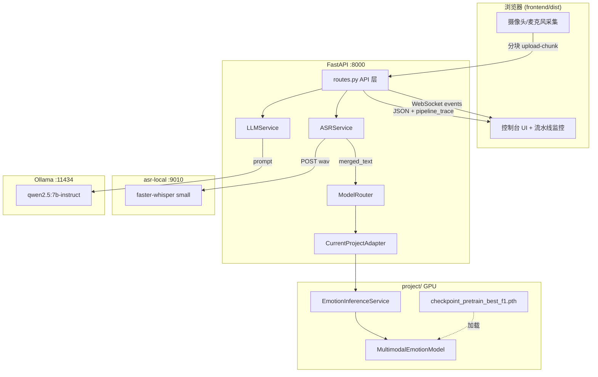

# Emotion Agent 系统架构与数据流文档

> 版本：2026-06-04  
> 范围：`multimodal/emotion-agent/` + `multimodal/project/`（训练模型推理运行时）  
> **系统架构总览（论文/答辩用）**：[`project/docs/SYSTEM_ARCHITECTURE_OVERVIEW.md`](../../project/docs/SYSTEM_ARCHITECTURE_OVERVIEW.md) · 配套图 [`figures/system_architecture_figure.html`](../../project/docs/figures/system_architecture_figure.html)  
> **准确率审计与路线图**：[`project/docs/EMOTION_ACCURACY_AUDIT_AND_ROADMAP.md`](../../project/docs/EMOTION_ACCURACY_AUDIT_AND_ROADMAP.md)

---

## 0. 部署权重与后处理（2026-06）

| 环节 | 说明 |
|------|------|
| 默认 preset | **`meld_only`**（MELD 单域 mp4，与在线 ResNet 一致） |
| 可选 | `ap2_m1` 三混合、`mosei_only`（注意 npy 域差）、`agent_chinese` |
| ASR 校准 | `project/utils/asr_emotion_calibration.py`（含扁平概率 + 纯「哈哈」） |
| 仲裁 | `backend/app/services/emotion_arbitration.py` → `final_emotion_label` 供 UI/LLM |
| 切换脚本 | `project/scripts/apply_deploy_preset.sh meld_only` |

---

## 1. 结论先行：是否使用 mock？

| 组件 | 当前配置 | 是否 mock | 判定依据 |
|------|----------|-----------|----------|
| 情绪分类 | `MODEL_PROVIDER=current` | **否** | `inference_source=checkpoint`，GPU 加载 `checkpoint_pretrain_best_f1.pth` |
| ASR | `ASR_PROVIDER=whisper_api` | **否** | `asr_provider=whisper_api`，9010 asr-local |
| LLM | `LLM_PROVIDER=ollama` | **否** | `llm_provider=ollama`，qwen2.5:7b-instruct |

**为何 ASR 说「开心」但情绪显示「平静」？**

这不是 mock，而是**两条独立链路**：

1. **LLM** 读取 ASR 文本（「我很开心…」）→ 生成积极回复  
2. **情绪模型** 读取 视频帧 + 音频波形 + 合并文本 → softmax 七分类 → 当前样本 top1 为 `neutral`（置信度 ~0.51，happy 次之 ~0.33）

在线演示与训练集存在域差异：单帧 JPEG、3 秒中文语音、`bert-base-uncased` 对中文语义弱、CREMA-D/MOSEI 以英文为主。

---

## 2. 系统总览



---

## 3. 目录与模块职责

```
multimodal/
├── emotion-agent/                    # 在线演示系统
│   ├── frontend/                     # React 浏览器客户端
│   │   └── src/
│   │       ├── App.jsx               # 采集、推理触发、流水线监控 UI
│   │       ├── api.js                # 分块上传、health、WS
│   │       └── styles.css
│   ├── backend/                      # FastAPI 编排层
│   │   └── app/
│   │       ├── main.py               # 单端口 8000 + 静态页
│   │       ├── api/routes.py         # 全 API + _emotion_infer_core
│   │       ├── adapters/
│   │       │   ├── current_project_adapter.py  # 桥接 project 推理
│   │       │   └── mock_adapter.py             # 仅 MODEL_PROVIDER=mock
│   │       ├── services/
│   │       │   ├── model_router.py   # 选择 adapter，禁止 silent mock*
│   │       │   ├── asr_service.py      # whisper_api / mock
│   │       │   ├── llm_service.py      # ollama / template
│   │       │   └── upload_buffer.py    # 分块上传重组
│   │       └── models/schemas.py       # EmotionInferResponse + pipeline_trace
│   ├── asr-local/                    # Whisper ASR 微服务 :9010
│   └── scripts/
│       ├── start_demo.sh             # build + 8000
│       └── start_all_demo.sh         # tmux 一键
│
└── project/                          # 训练工程 + 共享推理运行时
    ├── models/
    │   ├── multimodal_model.py       # MultimodalEmotionModel.forward
    │   ├── feature_extractors.py     # ResNet50 / Wav2Vec2 / BERT
    │   ├── leader_follower_attention.py
    │   ├── emotion_shift.py          # fusion_strategy=emotion_shift
    │   └── two_stage_fusion.py
    ├── utils/
    │   └── emotion_inference_service.py  # 加载 checkpoint + predict_from_sample
    ├── config/rerun/accuracy_plan/
    │   └── ap2_M1_effbatch8_ES_3ds_s3407.yaml
    └── checkpoints_accuracy_seq/.../checkpoint_pretrain_best_f1.pth
```

---

## 4. 端到端数据流（一次「结束并推理」）

### 4.1 浏览器采集

| 步骤 | 代码位置 | 输出 |
|------|----------|------|
| 截图 | `App.jsx` → `snapshotFrame()` | JPEG dataURL，宽≤160px |
| 录音 | WebAudio PCM → `encodeWav()` | 16kHz mono WAV，≤3s |
| 上传 | `api.js` → `inferEmotionUploadChunked()` | 32KB 分块 → `/emotion/upload-chunk` |
| 触发推理 | `api.js` | POST `/emotion/infer-from-upload` |

### 4.2 后端编排 `_emotion_infer_core`

文件：`backend/app/api/routes.py`

```
1_ingest     接收 session_id + video_b64 + audio_raw
     ↓
2_asr        ASRService.transcribe_bytes(wav) → whisper_api @9010
     ↓
3_text_merge merged_text = user_input OR asr_text
     ↓
4_emotion    ModelRouter.infer(sample) → CurrentProjectAdapter
     ↓
5_response   EmotionInferResponse + pipeline_trace + top_emotions
     ↓
6_agent      LLMService.generate_response(asr_text)  ← 独立链路
```

### 4.3 多模态送入训练模型

文件：`project/utils/emotion_inference_service.py` → `predict_from_sample()`

| 模态 | 输入 | 预处理 | 张量形状（典型） |
|------|------|--------|------------------|
| 视频 | JPEG bytes (base64) | `preprocess_video_from_bytes`：解码→112×112→复制 4 帧 | `(1, 4, 3, 112, 112)` |
| 音频 | WAV bytes | `preprocess_audio_from_bytes`：soundfile/librosa→3s@16k | `(1, 48000)` |
| 文本 | merged_text | `BertTokenizer` bert-base-uncased, max_len=128 | `(1, 128)` input_ids + mask |
| 生理 | — | 未启用 `use_physiological: false` | — |

### 4.4 模型前向

文件：`project/models/multimodal_model.py` → `forward()`

1. `VideoExtractor` (ResNet50) → 512d  
2. `AudioExtractor` (Wav2Vec2-base) → 512d  
3. `TextExtractor` (BERT) → 512d  
4. `EmotionShiftFusion`（leader=text）→ 融合特征  
5. 分类头 → `emotion_probs` (7,) + `emotion_dimensions` (valence, arousal)

输出映射：`happy,sad,angry,fear,neutral,anxious,other`

---

## 5. 代码级调用链

```
App.jsx stopCaptureAndInfer()
  └─ api.js inferEmotionUpload()
       └─ uploadBlobInChunks() × N
       └─ POST /api/v1/emotion/infer-from-upload

routes.py emotion_infer_from_upload()
  └─ assemble_upload() → audio_raw, video_raw
  └─ _emotion_infer_core()
       ├─ asr_service.py ASRService.transcribe_bytes()
       │    └─ HTTP POST asr-local:9010/v1/audio/transcriptions
       └─ model_router.py ModelRouter.infer(sample)
            └─ current_project_adapter.py CurrentProjectAdapter.infer()
                 └─ emotion_inference_service.py EmotionInferenceService.predict_from_sample()
                      └─ multimodal_model.py MultimodalEmotionModel.forward()
```

LLM 分支（与情绪模型并行、输入不同）：

```
routes.py agent_respond()
  └─ llm_service.py LLMService.generate_response()
       └─ HTTP POST ollama:11434/api/chat
            context_text = asr_text（非 emotion_label）
```

---

## 6. API 契约

### POST `/api/v1/emotion/infer-from-upload`

**响应关键字段：**

```json
{
  "emotion_label": "neutral",
  "confidence": 0.51,
  "inference_source": "checkpoint",
  "model_provider": "current",
  "all_probs_labeled": [
    {"id": 0, "label": "happy", "label_cn": "开心", "prob": 0.33},
    ...
  ],
  "pipeline_trace": {
    "steps": [
      {"stage": "1_ingest", "video_bytes": 1243, "audio_bytes": 96044},
      {"stage": "2_asr", "provider": "whisper_api", "text_preview": "我很开心..."},
      {"stage": "3_text_merge", "source": "asr", "merged_preview": "..."},
      {"stage": "4_emotion_model", "inference_source": "checkpoint", "is_mock": false}
    ],
    "modalities": {
      "video": {"preprocessed": true, "tensor_shape": [1,4,3,112,112]},
      "audio": {"preprocessed": true, "tensor_shape": [1,48000]},
      "text": {"preprocessed": true, "tokenizer": "bert-base-uncased"}
    },
    "model": {"called": true, "is_mock": false, "device": "cuda"}
  }
}
```

### GET `/api/v1/health`

确认：`using_trained_checkpoint`、`asr_ok`、`llm_ok` 均为 `true`。

### GET `/api/v1/model/status`

确认：`using_trained_checkpoint: true`，checkpoint 路径存在。

---

## 7. 前端监控面板（2026-05-27 新增）

| 面板 | 作用 |
|------|------|
| 流水线监控 | 展示 4 步 trace + 三模态卡片 + 模型调用信息 |
| 七类概率条 | `all_probs_labeled` 全量 softmax 可视化 |
| 运行日志 | 健康检查、采集、推理、LLM 时间线 |
| 原始 JSON | 完整 `EmotionInferResponse` |

---

## 8. mock 与真实推理对比

| 字段 | mock | 真实 checkpoint |
|------|------|-----------------|
| `inference_source` | `mock_heuristic` / `mock_fallback` | `checkpoint` |
| `inference_ms` | 0 | 通常 800–2000ms (GPU) |
| `all_probs` | 启发式/随机 | softmax，和≈1 |
| `checkpoint_file` | 空 | `checkpoint_pretrain_best_f1.pth` |
| 后端日志 | `[EMOTION_MODEL] startup provider=mock` | `[TRAINED_MODEL] forward label=...` |

---

## 9. 配置与环境变量

文件：`emotion-agent/backend/.env`

```env
MODEL_PROVIDER=current
MODEL_CHECKPOINT_PRESET=ap2_m1
PROJECT_ROOT=/path/to/multimodal/project
MODEL_DEVICE=cuda

ASR_PROVIDER=whisper_api
ASR_WHISPER_API_URL=http://127.0.0.1:9010/v1/audio/transcriptions

LLM_PROVIDER=ollama
LLM_MODEL=qwen2.5:7b-instruct
LLM_API_BASE=http://127.0.0.1:11434
```

Preset `ap2_m1` 解析为：

- Config: `project/config/rerun/accuracy_plan/ap2_M1_effbatch8_ES_3ds_s3407.yaml`
- Checkpoint: `project/checkpoints_accuracy_seq/AP2_M1_ES_3ds_effbatch8_s3407_20260422_210615/checkpoint_pretrain_best_f1.pth`
- Fusion: `emotion_shift`，modalities: video + audio + text

---

## 10. 部署拓扑与端口

| 端口 | 服务 | 启动命令 |
|------|------|----------|
| 9010 | asr-local | `asr-local/start_server.sh` |
| 8000 | backend + frontend/dist | `scripts/start_demo.sh` |
| 11434 | Ollama | `scripts/start_ollama.sh` |

详见 [`START_DEMO.txt`](../START_DEMO.txt)

---

## 11. 2026-05 改进（已落地）

### 11.1 视频 clip 对齐训练

- 前端：`MediaRecorder` 录制 ~3s `video/webm`，与音频同步
- 后端：`video_frame_utils.py` 与 `dataset._load_video` 相同 linspace 抽帧 → 4×112×112
- trace 字段：`decode_mode=video_file` | `single_frame_fallback`

### 11.2 LLM 与情绪模型对齐

- `llm_service._build_messages` 注入七类 `all_probs_labeled`
- 指令：回复以模型 Top1 为准，ASR 冲突时 bridging
- 前端展示「回复依据（情绪模型）」

### 11.3 bert-base-chinese 微调

- Config: `ap2_M1_chinese_text_agent.yaml`
- 脚本: `project/scripts/finetune_agent_chinese.sh`（`--skip_text_encoder` 从 ap2_m1 部分加载）
- Preset: `MODEL_CHECKPOINT_PRESET=agent_chinese`（微调完成后）

详见 [`IMPLEMENTATION_BATCHES.md`](IMPLEMENTATION_BATCHES.md)

---

## 12. 剩余限制

1. **域偏移**：webcam 与 CREMA/MOSEI 分布仍不同
2. **agent_chinese**：需先跑 GPU 微调脚本
3. **webm 解码**：服务器需 ffmpeg + opencv

---

## 13. 相关文档

- 分批实施：[`IMPLEMENTATION_BATCHES.md`](IMPLEMENTATION_BATCHES.md)
- 工程计划：`project/docs/EMOTION_AGENT_ENGINEERING_PLAN.md`
- 部署说明：`backend/README_DEPLOY.md`
- 启动手册：`START_DEMO.txt`
- 端口转发：`docs/端口转发说明.md`
