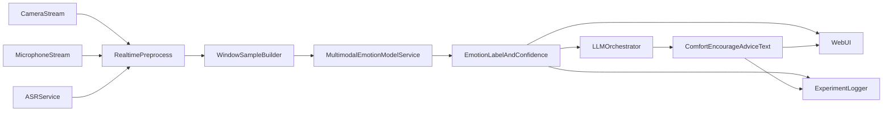

# 基于情感计算的人机交互智能体工程落地方案（论文配套）

## 1. 方案目标与边界

### 1.1 目标
- 在当前多模态情感模型实验成果基础上，落地完整闭环：实时采集 -> 三模态构建 -> 情绪识别 -> LLM生成交互话术 -> UI展示与日志归档。
- 方案与现有训练/重跑体系兼容，可作为硕士论文实验工程部分的实现蓝图。

### 1.2 边界
- 本方案聚焦在线推理与交互系统，不改动现有训练主链路（`scripts/train.py`）。
- 在线部分以视频+音频+文本三模态为主；生理信号通道保留扩展位，首版不强依赖。
- 输出目标优先保证“可演示、可复现、可写论文”，再追求工程完备度。

---

## 2. 现有能力复用与兼容性结论

### 2.1 可直接复用模块
- 模型与融合：`models/` 中标准融合、emotion_shift、leader_follower、two_stage、functional_correlation 等均已具备。
- 推理入口：`scripts/inference.py` 已实现视频/音频/文本输入预处理与情绪输出（7类情绪 + valence/arousal）。
- 指标与日志：`utils/helpers.py` 已具备 CSV/JSON 日志记录能力，可沿用到在线评估。
- 配置体系：`config/*.yaml` 已支持模态开关、损失配置、训练范式配置。

### 2.2 需新增但不破坏现有代码的能力
- 实时采集与滑窗切片（摄像头、麦克风、ASR）。
- 在线推理服务化封装（把当前单次推理脚本封装为 API 服务）。
- LLM 编排层（情绪标签到安慰/鼓励/提醒语生成）。
- 可视化 UI（实时预览、情绪卡片、对话面板、日志回放）。

### 2.3 兼容性原则
- 保持现有模型输入格式与标签体系不变（happy/sad/angry/fear/neutral/anxious/other）。
- 在线系统通过“适配层”对接现有 `inference` 逻辑，避免直接侵入训练代码。
- 新增配置文件与新脚本增量添加，不覆盖现有实验配置。

---

## 3. 总体架构（离线训练 + 在线推理解耦）



---

## 4. 在线数据采集与三模态构建设计

### 4.1 输入源
- 视频：摄像头实时帧流（建议 20~30 FPS 输入，模型前处理再降采样）。
- 音频：麦克风实时 PCM 流（16kHz）。
- 文本：ASR 实时转写结果（按时间戳对齐）。

### 4.2 时间窗策略（建议首版）
- 滑窗长度：3.0s（与当前音频预处理 duration 对齐）。
- 窗口步长：1.0s（平衡时效与稳定性）。
- 视频采样：每窗均匀取 8 帧（与当前常用配置兼容）。
- 文本拼接：取窗口内 ASR 分句并拼接；空文本时使用占位短句，避免输入为 None。

### 4.3 预处理与质量控制
- 视频：
  - 人脸检测失败时使用整帧回退，避免硬中断。
  - 分辨率按模型配置缩放（160 或 112，取当前实验稳定值）。
- 音频：
  - 语音活动检测（VAD）过滤静音段，降低噪声干扰。
  - 统一重采样到 16kHz，长度不足补零，超长截断。
- 文本：
  - ASR 置信度低于阈值时，文本模态权重降级（推理端策略）。

### 4.4 异常兜底
- 任一模态临时缺失时，允许双模态推理（如视频+音频），并标记 `degraded_mode=true`。
- 连续 N 窗口（建议 N=5）缺失同一模态，前端提示设备异常。

---

## 5. 模型服务化与接口契约

### 5.1 服务拆分建议
- `emotion-service`：封装现有模型加载与推理。
- `asr-service`：本地或云 ASR。
- `agent-service`：LLM 编排与话术安全策略。
- `web-ui`：交互可视化。

### 5.2 核心接口（建议）

- `POST /api/v1/emotion/infer`
  - 入参：视频帧序列、音频片段、文本、timestamp、session_id
  - 出参：
    - `emotion_label`
    - `confidence`
    - `valence`
    - `arousal`
    - `all_probs`
    - `degraded_mode`

- `POST /api/v1/agent/respond`
  - 入参：`emotion_label`, `confidence`, `context_text`, `user_profile(optional)`
  - 出参：
    - `reply_text`
    - `tone`（comfort/encourage/calm/risk_alert）
    - `safe_mode`

- `GET /api/v1/session/{id}/events`
  - 用于 UI 历史回放与论文案例导出。

### 5.3 输出等级策略
- 高置信（>=0.70）：按情绪标签直接生成个性化话术。
- 中置信（0.45~0.70）：生成保守话术并提示“可继续观察”。
- 低置信（<0.45）：返回安全模板，避免误导性情绪判断。

---

## 6. LLM 双路线推荐与配置

### 6.1 本地部署路线（答辩演示优先）
- 推荐模型：
  - `Qwen2.5-7B-Instruct`（量化后部署友好，速度与质量平衡）
  - `Qwen2.5-14B-Instruct`（质量更高，需更大显存）
- 部署方式建议：
  - Ollama（上手快）
  - vLLM（吞吐更高，适合并发）
- 优点：离线可演示、数据可控、答辩稳定。
- 风险：显存压力较大，需量化与并发控制。

### 6.2 API 路线（开发效率优先）
- 可选供应商：
  - OpenAI（稳定、生态成熟）
  - 阿里通义（国内可用性好）
  - 智谱 GLM（中文表现稳定）
- 优点：接入快、迭代快、模型质量稳定。
- 风险：网络依赖与调用成本；需脱敏日志与限流。

### 6.3 统一抽象层（强烈建议）
- 设计 `LLMClient` 统一接口：
  - `generate_response(emotion_label, confidence, context) -> reply`
- 通过配置切换：
  - `provider: local|openai|qwen-api|glm`
  - `model_name`
  - `api_base/api_key`
- 这样可无缝对比本地与 API 路线，便于论文实验设计。

### 6.4 提示词模板（首版）
- System：
  - 你是车载情绪陪伴助手，请基于情绪标签给出简短、温和、安全的话术，不做医疗诊断，不给危险建议。
- User 模板字段：
  - `emotion_label`
  - `confidence`
  - `valence/arousal(optional)`
  - `recent_context(optional)`
- 输出约束：
  - 单次 1~2 句，20~60 字。
  - 避免负强化词汇。
  - 若低置信则使用中性关怀模板。

---

## 7. UI 方案（最小可用到论文演示）

### 7.1 首版页面模块
- 摄像头预览区（含实时状态）。
- 情绪结果区（当前标签、置信度、情绪趋势条）。
- LLM 话术区（当前建议 + 最近 10 条历史）。
- 会话日志区（时间戳、输入质量、是否降级模式）。

### 7.2 交互原则
- 高频刷新：情绪状态（1s）。
- 低频刷新：LLM 文本（2~3s 或状态变化触发）。
- 明确显示“模型置信度”和“仅供辅助”的免责声明，降低误解风险。

### 7.3 技术建议
- 前端：React/Vue 任一（按你熟悉栈优先）。
- 后端：Python FastAPI（与现有 Python 推理代码衔接成本最低）。
- 通信：HTTP + WebSocket（状态流用 WS，管理接口用 HTTP）。

---

## 8. 实验评估设计（工程 + 学术）

### 8.1 工程指标
- 实时性：端到端平均延迟、P95 延迟。
- 稳定性：连续运行 30/60 分钟崩溃率、丢帧率。
- 资源：GPU/CPU 占用、显存峰值。
- 可用性：会话成功率、降级模式触发率。

### 8.2 学术指标
- 情绪分类：Accuracy / Precision / Recall / F1（与现有实验口径一致）。
- 连续维度：Valence/Arousal MAE、MSE（若启用）。
- 消融对比：
  - noDA vs DA
  - AT vs VT vs AVT
  - standard vs emotion_shift（后续补齐）
- 交互效果主观评估：
  - 话术有用性（Likert 5分）
  - 语气舒适度
  - 用户信任度

### 8.3 论文映射建议
- 第3章（方法）：多模态模型与融合机制（复用现有实验）。
- 第4章（系统实现）：在线采集、推理服务、LLM 编排、UI。
- 第5章（实验）：离线指标 + 在线系统指标 + 用户主观评价。
- 第6章（结论与展望）：工程可行性、局限（ASR误差/延迟）与后续优化。

---

## 9. 工作量评估与里程碑（建议 4 周）

### Week 1：接口与最小链路
- 完成在线采集原型（视频/音频/ASR）。
- 完成 emotion-service API 封装（复用现有推理逻辑）。
- 验收：能稳定输出实时情绪标签。

### Week 2：LLM 与策略
- 接入本地 LLM（主）+ API LLM（备）。
- 完成提示词模板、低置信兜底策略。
- 验收：可根据情绪标签稳定产出话术。

### Week 3：UI 与日志
- 完成 Web UI MVP 与会话日志导出。
- 打通端到端链路，支持演示模式。
- 验收：实时展示 + 历史回放可用。

### Week 4：评测与论文材料
- 采集工程指标和主观评价数据。
- 形成对比表与案例图，写入论文实验章节。
- 验收：答辩演示脚本 + 实验表格完备。

### 总工作量估计
- 约 2.5~4 周（单人，已有模型基础条件下）。
- 风险上限：若本地 LLM 资源不足，切 API 路线可缩短 3~5 天。

---

## 10. 风险清单与回滚策略

- ASR 误识别导致文本噪声：
  - 回滚：降权文本模态，切换双模态推理。
- 本地 LLM 显存不足：
  - 回滚：7B 量化模型或切 API。
- 端到端延迟超标：
  - 回滚：增大窗口步长、降低视频帧采样、异步化 LLM 调用。
- 在线服务不稳定：
  - 回滚：启用模板话术模式，保障答辩演示连续性。

---

## 11. 未完成实验预留位（后续补录）

### 11.1 AVT noDA（进行中）
- 记录字段：last/best acc、last/best f1、在线推理表现、与 AVT DA 对比结论。

### 11.2 AVT emotion_shift（进行中）
- 记录字段：与 standard 融合的离线/在线对比、话术质量主观评分差异。

---

## 12. 模型部署（已实现，2026-05-23）

### 12.1 Checkpoint 预设

| `MODEL_CHECKPOINT_PRESET` | 训练 config | 混合 val Best F1 | 用途 |
|---------------------------|-------------|------------------|------|
| `ap2_m1`（默认） | `config/rerun/accuracy_plan/ap2_M1_effbatch8_ES_3ds_s3407.yaml` | ≈0.562 | 全局最优，答辩主推荐 |
| `ap4_w005` | `config/rerun/accuracy_plan/ap4_config_AVT_DA_w005_accuracy_seq.yaml` | ≈0.528 | standard+DA 稳定线 |

### 12.2 启动示例

```bash
cd emotion-agent/backend
# .env: MODEL_PROVIDER=current, MODEL_CHECKPOINT_PRESET=ap2_m1, PROJECT_ROOT=.../project
uvicorn app.main:app --host 0.0.0.0 --port 8000
```

详见 [`emotion-agent/backend/README_DEPLOY.md`](../../emotion-agent/backend/README_DEPLOY.md)。

### 12.3 实现要点

- 共享运行时：[`project/utils/emotion_inference_service.py`](../utils/emotion_inference_service.py)
- Agent 适配：[`emotion-agent/backend/app/adapters/current_project_adapter.py`](../../emotion-agent/backend/app/adapters/current_project_adapter.py)
- 单帧 JPEG 复制为 `num_frames` 路；音频 WAV base64 对齐 3.0s@16kHz

### 12.4 ASR（2026-05-27）

- **禁止** `ASR_PROVIDER=mock` 用于演示：mock 返回固定假句，与真实语音无关。
- 本地 ASR：`emotion-agent/asr-local`（faster-whisper，`POST /v1/audio/transcriptions`，端口 **9010**）。
- 后端：`ASR_PROVIDER=whisper_api`，`GET /api/v1/health` 含 `asr_ok`。
- 启动顺序：`asr-local/start_server.sh` → `scripts/start_ollama.sh` → `backend/start_server.sh` → 前端 `npm run dev`。
- 情绪标签 **不是 mock**：`inference_source=checkpoint` 表示 AP2 权重；在线摄像头+中文常偏低置信并偏向 `neutral`（与训练分布有关）。
- LLM：`LLM_PROVIDER=ollama` 且 `llm_ok=true` 时才有生成式话术；否则 `template` 兜底。

---

## 14. 系统化测试（2026-07-09，R4 close-out 后）

R4 GPU 实验线关闭后，Agent 测试成为主轨。完整 Phase 0–3 结果见 **[`AGENT_TEST_REPORT_20260709.md`](AGENT_TEST_REPORT_20260709.md)**。

| Phase | 内容 | 关键命令 |
|-------|------|----------|
| 0 | 基线 | `backend/scripts/verify_trained_model.sh`；`curl /api/v1/health` |
| 1 | 离线 | `pytest tests/test_emotion_arbitration.py`；`eval_zh_agent_benchmark.py` |
| 2 | Preset | 默认 `sdavt_meld_v3_r4`；metadata `checkpoint_preset` 切换 |
| 3 | E2E | `start_full_stack.sh` 或 backend+ASR；`infer-upload` + `pipeline_trace` |

默认 preset 已更新为 **sdavt_meld_v3_r4**（M3_M7 F1=0.696），见 [`config_agent_deploy.yaml`](../config/config_agent_deploy.yaml) 与 `apply_deploy_preset.sh`。

---

## 13. 结论（可直接用于论文措辞）

你的总体设想是合理且工程上可落地的：当前项目已经具备高质量多模态情感识别基础；**真实 checkpoint 推理已接入 emotion-agent**。后续可继续优化在线延迟、ASR 质量与组合实验（AP2 配方 + AP4 DA）。采用“离线训练稳定 + 在线推理闭环 + LLM 双路线”的方案，既能与既有实验完全兼容，也能在软件工程专硕答辩中体现完整系统能力、实验可复现性和工程取舍思维。
