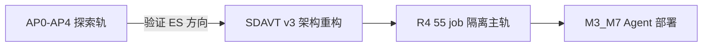
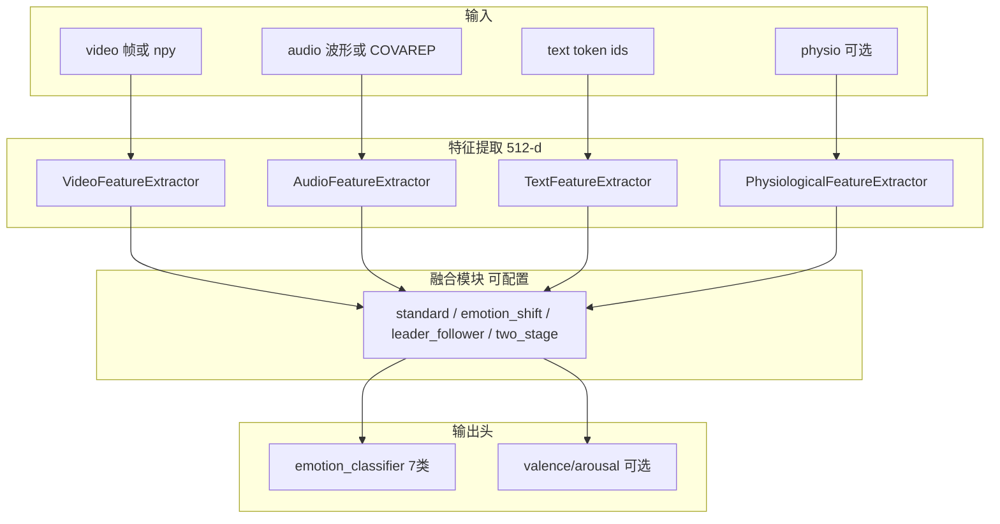
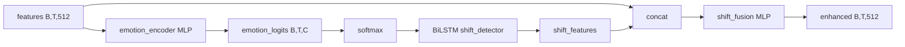
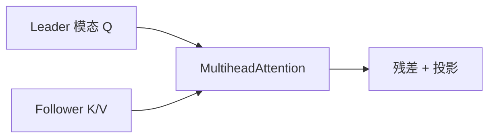
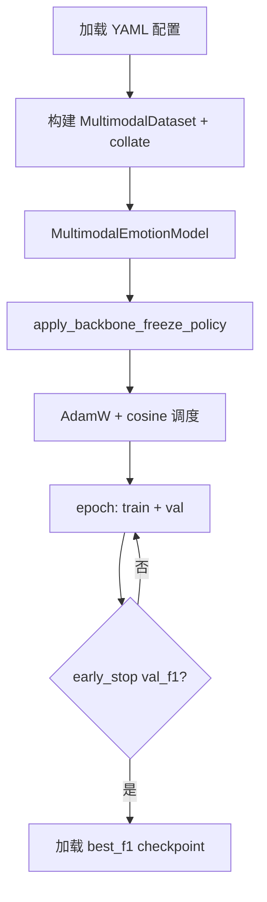
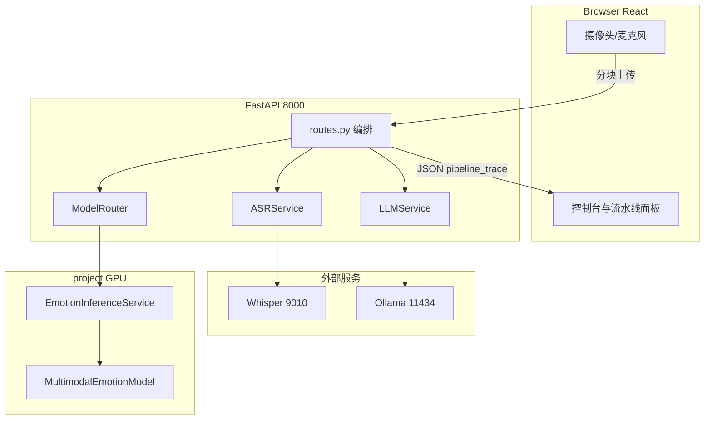

# 多模态情感分析 — 全栈技术架构与实验总结（Master）

**版本**：2026-07-09 v2（R4 close-out）  
**状态**：R4 **close-out 完成**；MELD **M3_M7** F1=0.696；MOSEI **F_O_ES** F1=0.679；CREMA **C4_C3** Acc=0.605（Tier-2 CLOSE-OUT）；Agent 默认 **`sdavt_meld_zh_agent_v2`**（英文自动 → `sdavt_meld_v3_r4`）  
**配套图**：[`figures/system_architecture_figure.svg`](figures/system_architecture_figure.svg)  
**指标刷新**：`python scripts/build_master_doc_metrics.py` → `assemble_master_document.py`（2026-07-09 11:55 UTC）

> 本文档以**技术架构**为主线：SDAVT 多模态情绪模型（编码器 + 融合 + 训练）与 emotion-agent 在线系统（React + FastAPI + ASR + 推理 + LLM）。  
> 实验部分聚焦 **R4 主轨**；AP0–AP4 仅作探索背景。不罗列仓库内数百篇 md 路径；运维脚本见附录 A 索引。

---

## 目录

### Part I 背景与方法
- [第1章 研究背景与相关工作](#第1章-研究背景与相关工作)
- [第2章 实验设计思路与演进](#第2章-实验设计思路与演进)

### Part II SDAVT 模型架构
- [第3章 总体架构 MultimodalEmotionModel](#第3章-总体架构-multimodalemotionmodel)
- [第4章 模态编码器](#第4章-模态编码器)
- [第5章 融合模块深读](#第5章-融合模块深读)
- [第6章 数据与训练流程](#第6章-数据与训练流程)

### Part III R4 实验结果
- [第7章 R4 主结果与分阶段解读](#第7章-r4-主结果与分阶段解读)
- [第8章 工程问题与修复要点](#第8章-工程问题与修复要点)

### Part IV Emotion Agent
- [第9章 智能体总体架构](#第9章-智能体总体架构)
- [第10章 前端模块与交互](#第10章-前端模块与交互)
- [第11章 后端模块与推理链路](#第11章-后端模块与推理链路)
- [第12章 中文域优化与部署](#第12章-中文域优化与部署)

### 附录
- [附录 A 核心脚本索引](#附录-a-核心脚本索引)
- [附录 B Checkpoint 与端口](#附录-b-checkpoint-与端口)
- [附录 C 论文数字锚点](#附录-c-论文数字锚点)

---

# Part I 背景与方法


## 第1章 研究背景与相关工作

### 1.1 任务定义与研究动机

多模态情感识别（Multimodal Emotion Recognition, MER）旨在联合视觉、语音、文本等异构信号，推断离散情绪类别或连续情感维度（效价/唤醒）。在智能座舱、对话系统与人机协同场景中，单一模态易受噪声、遮挡或 ASR 误差影响；多模态融合可在语义（文本）、韵律（音频）与表情（视频）之间互补，提高鲁棒性。

本项目的工程目标是：在**统一模型骨架**上，通过 YAML 配置完成模态组合、融合策略与训练协议切换，形成可复现的消融矩阵；并将离线训练得到的最优 checkpoint 部署到 **emotion-agent** 在线演示系统，完成「采集 → ASR → 多模态推理 → 校准/仲裁 → LLM 回复」的端到端闭环。

### 1.2 国内外方法脉络

MER 方法大致经历三阶段：（1）浅层融合——各模态独立编码后拼接或加权投票；（2）跨模态注意力 / Transformer——MulT 等工作对未对齐的 T/V/A 序列做交互；（3）动态融合与鲁棒增强——显式建模情绪转变、模态质量不均与跨域偏移。下表概括本项目**实际参照**的代表性工作；正文各小节将对核心论文做「原文思想 → 代码映射 → 默认配置」三段式说明。

| 类别 | 代表文献 | 核心贡献 |
|------|----------|----------|
| 跨模态 Transformer | MulT (ACL 2019) | 未对齐多模态序列的 cross-attention |
| 情绪转变感知 | CFN-ESA (arXiv:2307.15432) | 对话情感**转变**建模 + 跨模态融合 |
| 图+两阶段融合 | GA2MIF (arXiv:2207.11900) | GAT + 两阶段多源融合 |
| Leader-Follower | ICCV 2021 | 非对称注意力，高质量模态引导 |
| 功能最大相关 | MFMC (arXiv:2512.23076) | 跨模态表示相关性约束 |
| 预训练骨干 | BERT, Wav2Vec2, ResNet | 文本/语音/视觉表征 |

国内相关研究多集中在 CNN/LSTM/注意力融合与视频人物表情识别；本项目在工程上采用预训练 Transformer 骨干 + 可切换融合模块，与早期手工特征路线形成代际差异。

### 1.3 CFN-ESA：Emotion-Shift 融合（本项目主融合）

**文献**：Li 等，*CFN-ESA: A Cross-Modal Fusion Network with Emotion-Shift Awareness for Dialogue Emotion Recognition*，arXiv:2307.15432，2023。参考实现见 `models/emotion_shift.py` 文件头（原论文 GitHub: jianglil/Cross-Modal-Fusion-Network）。

**原文问题设定**：对话情感随轮次**动态变化**；仅对当前 utterance 做多模态平均池化会丢失「从 happy 转为 sad」等转移模式。

**原文方法要点**：（1）显式预测逐步情感分布；（2）用 LSTM 对情感概率序列建模 shift；（3）shift-aware 表示 + 跨模态注意力。

**本项目复现**（`models/emotion_shift.py`）：

**EmotionShiftAwareness**：输入 `(B,T,512)` → LayerNorm → MLP 得 `emotion_logits (B,T,C)` → softmax → **BiLSTM shift_detector**（2 层双向）→ 与原始特征 concat → shift_fusion MLP → `enhanced (B,T,512)`；**shift_weights** 为相邻步概率 L1 差。

**EmotionShiftFusion**：四模态 512-d 特征经可学习 **modal_weights** softmax 加权（respect `active_mask`）→ EmotionShiftAwareness → 以 **`leader_modal`**（默认 text）为 Query、其余模态为 K/V 做 **MultiheadAttention(8 heads)** → LayerNorm + Dropout → `(B,512)`。

**与部署关系**：M3_M7_combo、Agent preset `sdavt_meld_v3_r4` 均为 `fusion_strategy: emotion_shift`、`leader_modal: text`；中文 router 可 override 为 audio。

### 1.4 GA2MIF：Two-Stage 图注意力融合

**文献**：Li 等，*GA2MIF*，arXiv:2207.11900，2022。  
**核心思想**：将各模态视为图节点，Stage1 用图注意力（GAT 思想）建模模态间结构关系；Stage2 再做 self-attention 与 leader cross-attention 细化。

**本项目实现**：`models/two_stage_fusion.py` 中 `GraphAttentionLayer` + `TwoStageFusion`。  
**实验结论**：AP3 阶段曾出现 **two_stage 训练塌缩**（融合向量 batch 内方差→0，恒预测 neutral）；R4 p0_fix 后可用作消融对照，**不作论文主融合**。主融合固定为 emotion_shift。

### 1.5 Leader-Follower 非对称融合

**文献**：Zhang 等，*Continuous Emotion Recognition with Audio-Visual Leader-Follower Attentive Fusion*，ICCV 2021。  
**核心思想**：指定一个 Leader 模态（通常为文本或音频），其 Query 去 attend Follower 模态的 Key/Value，避免对称融合中低质量模态「拖垮」整体。

**本项目实现**：`models/leader_follower_attention.py` — `LeaderFollowerAttention`、`MultimodalLeaderFollowerFusion`。配置字段 `fusion_strategy: leader_follower`，R4 中 job 如 F_M_LFT、F_O_LFT。Leader 模态由 yaml 的 `leader_modal` 指定（text / audio / video）。

### 1.6 MFMC 与 Standard 基线

**MFMC**（arXiv:2512.23076）：通过「功能最大相关」约束跨模态表示一致性。代码：`models/functional_correlation.py`，可选 `use_fmc_loss: true`。  
**Standard 融合**：`MultimodalFusion`（`attention_modules.py`）对各模态 512-d 向量拼接后 MLP，作为最稳定基线；R4 p1 baseline 与 p2 中 F_*_STD 均为此策略。

### 1.7 预训练骨干与 Word2Vec 说明

#### 1.7.1 文本：Transformer 为主线

**BERT**（Devlin 等，NAACL 2019）与 **RoBERTa**（Liu 等，2019）均为多层 **Transformer encoder**：Self-Attention 使每个 token 表示依赖双向上下文，适合 MELD 对话与 ASR 合并文本中的多义词与长距离依赖。

本项目 `TextFeatureExtractor` 使用 HuggingFace `AutoModel` 加载 `bert-base-uncased` 或 `roberta-base`：

- 前向取 **pooler_output** 或 **[CLS] hidden state**（768-d）。  
- 线性投影至 **512-d** 与音视频对齐。  
- 训练时默认**冻结**全部 encoder 层；yaml 设 `unfreeze_encoder_layers: 1` 时仅解冻最后 1 层 Transformer block（M3_M7 配方）。

**Word2Vec**（Mikolov 等，NeurIPS 2013）提供**静态**词向量：一词一向量，无上下文 disambiguation。学位论文 [`THESIS_FULL_DRAFT_MULTIMODAL_EMOTION.md`](THESIS_FULL_DRAFT_MULTIMODAL_EMOTION.md) 中将其作为轻量基线讨论。**本仓库未实现 Word2Vec 编码路径**；若论文需对比，应说明「理论对照项，非本系统运行时配置」。

#### 1.7.2 语音：Wav2Vec2

**Wav2Vec2**（Baevski 等，NeurIPS 2020）在大量无标注语音上自监督预训练：CNN 特征提取 + Transformer 上下文编码。本项目使用 `facebook/wav2vec2-base-960h` 或 **large-960h**（M3_M7/C3_C2），波形经 Processor 特征化后 forward，**时间维 mean-pool** → 768-d → 投影 512-d。推理与训练时 Wav2Vec2 权重**冻结**，仅训练投影与下游融合/分类头。

#### 1.7.3 视觉：ResNet50

**ResNet50**（He 等，CVPR 2016）通过残差连接训练深层 CNN。本项目用 ImageNet 预训练权重，去掉 FC，每帧 2048-d → 投影 512-d。视频 clip 取 **T=4** 帧（112×112），帧特征经 mean 或 LSTM 聚合。Agent 在线从单帧 JPEG **复制 4 份** 对齐训练形状。

#### 1.7.4 小结表

| 模态 | 主线技术 | 输出维 | 代码类 |
|------|----------|--------|--------|
| 文本 | BERT / RoBERTa (Transformer) | 512 | TextFeatureExtractor |
| 语音 | Wav2Vec2 (CNN+Transformer) | 512 | AudioFeatureExtractor |
| 视频 | ResNet50 (CNN) | 512 | VideoFeatureExtractor |
| 文本对照 | Word2Vec | — | **未实现** |

### 1.8 数据集（文献层面）

- **MELD**（Poria 等，ACL 2019）：Friends 剧集多方对话，7 类情感；与 Agent 在线域（mp4 + 文本）一致，**主实验与部署域**。  
- **CMU-MOSEI**（Zadeh 等，ACL 2018）：大规模视频评论，常用预计算 OpenFace/COVAREP；本项目用于离线 npy 轨，**在线不直接使用 npy**。  
- **CREMA-D**（Cao 等，IEEE TAC 2014）：演员情感音视频，6 类；用于 Acc 挑战与音频消融；Tier-2 目标 Acc≥0.63，当前 champion **C3_C2 Acc=0.567**（close-out）。


## 第2章 实验设计思路与演进

### 2.1 设计原则：统一骨架 + 配置驱动

全项目仅维护一个主干 **`MultimodalEmotionModel`**（`models/multimodal_model.py`）。下列决策**不修改 Python 代码**，而通过 YAML 切换：

- 启用模态：`model.modalities.use_video/audio/text/physiological`
- 融合策略：`model.attention.fusion_strategy` ∈ {standard, emotion_shift, leader_follower, two_stage}
- Leader 模态：`leader_modal`（对 ES/LF 生效）
- 训练协议：pretrain/finetune 数据集列表、学习率、early-stop、采样 mode（uniform 等）
- 损失：class-balanced / focal / label smoothing / FMC / 域对抗（DA）

单变量消融要求：AP2 只动训练超参、AP3 只动 fusion、AP4 只动 DA 权重——避免「改多处却无法归因」的常见论文陷阱。

### 2.2 实验阶段演进



| 阶段 | 时间 | 目录标识 | 角色 |
|------|------|----------|------|
| AP0–AP4 | 2026-03~05 | `logs_accuracy_seq/` | **探索轨**：验证 emotion_shift 配方、融合、DA；早轮存在塌缩、日志污染，**不作论文主数据** |
| SDAVT v3 | 2026-05~06 | `config/sdavt_v3/` | 架构重构与 MOSEI 修复 |
| **R4** | 2026-06~07 | `logs_sdavt_v3_r4/` | **论文主轨**：55 job、queue audit、Tier-2 验收 |
| Agent | 2026-07 | `emotion-agent/` | 默认加载 M3_M7 checkpoint |

### 2.3 AP 探索轨结论（压缩摘要）

AP 阶段的价值在于**方向验证**，而非最终数字：

- **AP2**（三混合 + emotion_shift）：M1（有效 batch 8）Best Acc 约 0.607，说明 emotion_shift 配方在三域混合下可训练；但 `logs_accuracy_seq` 与 R4 目录未隔离，存在续训与 log 槽位风险。  
- **AP3**（融合消融）：standard 与 leader_audio 较稳定；**two_stage 无效**（融合输出塌缩为常数，恒预测 neutral）。  
- **AP4**（DA 扫描）：w005 取得 AP4 内最佳 F1≈0.528；与 AP2 的 emotion_shift 协议不同，**不可直接排名**。

**结论**：R4 在独立目录 `logs_sdavt_v3_r4/`、`checkpoints_sdavt_v3_r4/` 下重跑系统化消融，引入 `audit_r4_training_health.py`（P0 门槛）、Tier-2 验收与 `replace_log_dir`，保证指标可追溯。论文与 Agent 均以 **R4 M3_M7_combo** 为锚点。

### 2.4 R4 队列结构（P0→P4）

| Phase | 目的 | 规模 |
|-------|------|------|
| p0_fix | 四融合策略修复后可训练 | 6 |
| p1_baseline | 三数据集 baseline | 3 |
| p2_fusion | 四融合 × 三数据集 | 15 |
| p3_m3 / p3_c3 | MELD / CREMA 组件消融 | 8 + 3 |
| p4_modal | T/A/V/… 模态组合消融 | 21 |

队列定义：`outputs_sdavt_v3_r4/experiment_queue.json`；指标自动汇总：`build_sdavt_r4_report.py`。


# Part II SDAVT 模型架构

## 第3章 总体架构 MultimodalEmotionModel

### 3.1 组件总览

`MultimodalEmotionModel` 是离线训练与在线推理的**唯一神经网络主干**。其职责链为：



### 3.2 模态门控 active_mask

在 forward 之前，`_build_active_mask` 根据配置开关与张量是否为空决定各模态是否参与融合（P4 单模态消融依赖此机制）：

```166:172:project/models/multimodal_model.py
    def _build_active_mask(self, video, audio, physiological, text_input_ids, audio_precomputed):
        return {
            'video': self.use_video and video is not None,
            'audio': self.use_audio and (audio is not None or audio_precomputed is not None),
            'physiological': self.use_physiological and physiological is not None,
            'text': self.use_text and text_input_ids is not None,
        }
```

缺失模态在 extractor 层以零向量占位，但 `active_mask=False` 的模态**不参与** ES/LF/TS 的加权与 K/V 拼接，避免「假模态」稀释融合（MOSEI P4 曾因此 ln(7) 塌缩）。

### 3.3 融合策略切换

`__init__` 中读取 `model.attention.fusion_strategy`，实例化四类之一：

| 值 | 类 | 论来源 |
|----|-----|--------|
| emotion_shift | EmotionShiftFusion | CFN-ESA |
| leader_follower | MultimodalLeaderFollowerFusion | ICCV 2021 |
| two_stage | TwoStageFusion | GA2MIF |
| standard | MultimodalFusion | 基线 concat+MLP |

分类头 **`emotion_classifier`** 始终作用于融合后的 `fused_features`（512-d → num_classes），保证 ES 与 standard 路径输出维度一致。

### 3.4 部署冠军 M3_M7 配置摘要

Agent 与论文主结果对齐以下配置（字段语义，非完整 yaml）：

| 字段 | 值 | 含义 |
|------|-----|------|
| fusion_strategy | emotion_shift | CFN-ESA 主融合 |
| leader_modal | text | 文本主导 cross-attention |
| text.backbone | roberta-base | 替代 BERT，unfreeze 1 层 |
| audio.backbone | wav2vec2-large-960h | 大模型音频 |
| video | 112×4 帧 ResNet50 | 与线上一致 |
| sampling.mode | uniform | 域均衡 |
| loss | focal + label_smoothing 0.1 | 防过拟合 |
| early_stopping.monitor | val_f1 | 主监控指标 |

### 3.5 forward 逐步数据流

一次训练/推理 batch 在 `MultimodalEmotionModel.forward()` 中的执行顺序：

1. **输入**：`video, audio, audio_precomputed, text_input_ids, text_attention_mask`（生理 optional）。  
2. **active_mask** = `_build_active_mask(...)`。  
3. **Extractors**（各自 512-d）：  
   - `video_extractor(video)` → `(B,512)` 或 `(B,T,512)`  
   - `audio_extractor(audio or precomputed)` → `(B,512)`  
   - `text_extractor(input_ids, mask)` → `(B,512)`  
4. **Fusion**（以 ES 为例）：`EmotionShiftFusion(v,a,p,t, active_mask=mask)` → `fused (B,512)`。  
5. **Heads**：`emotion_classifier(fused)` → logits `(B,7)`；可选 `regressor` → valence/arousal `(B,2)`。  
6. **输出 dict**：`emotion_logits`, `emotion_probs`, `emotion_dimensions`, 可选 `shift_weights`。

在线 `EmotionInferenceService._forward` 取 `argmax(probs)` 映射到七类字符串；Agent 再将结果写入 `pipeline_trace.output`。

Checkpoint：`checkpoints_sdavt_v3_r4/SDAVT_R4_M3_M7_combo/checkpoint_pretrain_best_f1.pth`。


## 第4章 模态编码器

四类编码器均在 `models/feature_extractors.py` 实现，输出维度默认 **512**，供融合模块使用。

### 4.1 视频：VideoFeatureExtractor

**技术**：ImageNet 预训练 **ResNet50**（去掉最后 FC），对每帧提取 2048-d 再线性投影；或读取 **OpenFace 713-d** 预计算 npy（MOSEI 轨），经 `TemporalNpyEncoder`/投影对齐。

| 场景 | 输入形状 | 处理 |
|------|----------|------|
| MELD/CREMA 训练 | (B, T, 3, H, W) T=4, H=W=112 | CNN 逐帧 → 时序 mean 或 BiLSTM |
| MOSEI 训练 | (B, T, 713) | 预计算投影 |
| Agent 在线 | JPEG → 解码复制 4 帧 | 与训练 clip 对齐 |

**冻结策略**：R4 中 ResNet **永久冻结**（`train.py` `apply_backbone_freeze_policy`），仅训练投影与融合/分类头，防止小数据集过拟合。

### 4.2 音频：AudioFeatureExtractor

**技术**：**Wav2Vec2**（Facebook `wav2vec2-base` 或 `wav2vec2-large-960h`）。波形输入经 Processor 转 mel 特征 → Wav2Vec2 编码 → 时间维 mean-pool → 线性投影到 512-d。骨干默认**冻结**，只训练投影层。

**MOSEI 预计算分支**（关键工程修复）：COVAREP 特征 `(B,T,74)` 不再进 BiLSTM（易反向 NaN），改为 **mean-pool + MLP**；collate 仅写入 `audio_precomputed`，`audio=None`，避免 Wav2Vec2 误读 3D 张量。

| 场景 | 输入 | 路径 |
|------|------|------|
| MELD/Agent | 16kHz 波形 ≤3s | Wav2Vec2 |
| MOSEI | COVAREP npy | precomputed mean-pool |

### 4.3 文本：TextFeatureExtractor

**技术**：HuggingFace **BERT** 或 **RoBERTa**（`AutoModel`）。取 pooler 或 [CLS] 向量 → 投影 512-d。  
**微调**：`unfreeze_encoder_layers: N` 解冻 encoder 最后 N 层（M3_M7 为 1）；其余层冻结。

**Word2Vec 说明**：学位论文讨论中 Word2Vec 作为**静态词向量基线**，对比 BERT 的上下文建模能力。**本仓库未实现 Word2Vec 编码路径**；所有训练与推理均使用 Transformer。中文 Agent 可选 `bert-base-chinese`（preset `sdavt_meld_zh_agent`）。

**在线域差**：默认 RoBERTa/BERT 为**英文**词汇表；中文 ASR 文本语义弱，需配合第 12 章中文路由（skip_text / leader_audio）或中文微调。

### 4.4 生理：PhysiologicalFeatureExtractor

BiLSTM 或 1D-CNN 处理生理序列（驾驶场景扩展）。当前 M3_M7 与 Agent 部署 **`use_physiological: false`**，模块保留供后续扩展。

### 4.5 张量形状约定

| 阶段 | 典型形状 |
|------|----------|
| 视频 CNN | (B, 4, 3, 112, 112) |
| 音频波形 | (B, 48000) @ 16kHz×3s |
| 文本 | (B, L) input_ids + attention_mask |
| 模态特征 | (B, 512) 或 (B, T, 512) |
| 融合输出 | (B, 512) |
| logits | (B, 7) |


## 第5章 融合模块深读

### 5.1 Emotion Shift / CFN-ESA（主融合）

#### 5.1.1 论文动机

对话中情感标签随时间变化；CFN-ESA 认为融合表示应包含「**转变感知**」成分，而非各模态静态加权平均。原论文针对文本主导的 dialogue emotion recognition；本项目将其扩展到 V+A+T 四模态，并在驾驶/Agent 时序监测场景保留 shift 权重 interpretability。

#### 5.1.2 EmotionShiftAwareness 内部结构



- **emotion_encoder**：Linear→ReLU→Dropout→Linear，逐步预测 C 类 logits。  
- **shift_detector**：2 层双向 LSTM，输入为 emotion 概率序列，输出 shift 上下文。  
- **shift_weights**：相邻步概率 L1 差之和，刻画「这一刻转变有多剧烈」。  
- **数值稳定**：`input_norm`、`nan_to_num`、logits clamp，防止 MOSEI/混合训练 NaN。

#### 5.1.3 EmotionShiftFusion 前向逻辑

1. 四模态特征 pool 到 `(B,1,512)`，按 `active_mask` 过滤。  
2. **可学习 modal_weights**（4 维 softmax）加权求和 → `weighted_feat`。  
3. 调用 `EmotionShiftAwareness(weighted_feat)` → `enhanced_feat` + auxiliary logits。  
4. 以 **`leader_modal`** 对应模态为 Query（默认 **text**），其余活跃模态 stack 为 Key/Value，做 **MultiheadAttention**（8 heads）。  
5. 残差 + LayerNorm + Dropout → 输出 `(B,512)`。

**leader_modal 的工程含义**：cross-attention 的「主导语义/韵律」来自哪一路。M3_M7 设为 text；P4 视频单模态 job **R4_A_M_V** 曾错误保留 `leader_modal:text` 导致与 video-only 矛盾、F1 塌缩至 0.27；修复为 `leader_modal: video` 后重训。

#### 5.1.4 与 MultimodalEmotionModel 的衔接

`forward()` 中各 extractor 输出传入 `EmotionShiftFusion(..., active_mask=active_mask)`；返回的 `fused_features` 进入共享 `emotion_classifier`。ES 模块另返回 `emotion_logits`/`shift_weights` 供可视化或辅助损失（当前主损失仍为分类 CE/focal）。

### 5.2 Leader-Follower 融合

**论文**：Zhang 等，ICCV 2021，连续情感识别中的音视频 Leader-Follower 注意力。

**结构**（`leader_follower_attention.py`）：



- `LeaderFollowerAttention`：单对单，Leader Q attend Follower K/V。  
- `MultimodalLeaderFollowerFusion`：默认 text 为 leader，依次增强 video/audio/physio follower，再 concat → MLP。

**配置**：`fusion_strategy: leader_follower`；R4 jobs F_M_LFT 等。CREMA 上弱于 ES；可作消融对照。

### 5.3 Two-Stage 融合（GA2MIF）

**Stage1**：四模态节点经 `GraphAttentionLayer`（self-attention 模拟 GAT）交互。  
**Stage2**：每模态 self-attention + 与 leader 的 cross-attention + FFN。

**塌缩风险**：当 physiological 支路恒为零、三混合 batch 复杂时，Stage1 可能将表示压成 batch 无关常数（AP3 已验证）。R4 仅作 p0_fix 与 p2 对照，**禁止作主融合**。

### 5.4 Standard 基线

`MultimodalFusion`：活跃模态 512-d 向量拼接 → MLP → 512-d。参数少、优化 landscape 平滑，是 p1 baseline 与 fusion 对照的稳定锚点。


## 第6章 数据与训练流程

### 6.1 三数据集与选用理由

| 数据集 | 类别 | 媒体 | 本项目角色 |
|--------|------|------|------------|
| MELD | 7 | mp4 + 文本 | **主域**；M3_M7 冠军；Agent 默认 |
| CMU-MOSEI | 7 | OpenFace/COVAREP npy | 离线大规模融合验证；**在线域不同** |
| CREMA-D | 6 | flv + wav | Acc 挑战；C3_C2 champion Acc=0.567 |

**标签统一**：`utils/label_mapping.py` 定义跨数据集 unified 7 类与 native 类；MELD `joy→happy`，CREMA native 6 类中 neutral/disgust 索引与 unified 不同。R4 MELD job 常用 `use_native_labels: true`。

### 6.2 数据管线（逻辑）

1. 原始数据经 `organize_meld.py` / `organize_crema_d.py` / `organize_cmu_mosei_*.py` 写入 `data/{split}/{video,audio,text,labels}/`。  
2. `MultimodalDataset` 按样本前缀加载；collate 组 batch。  
3. **MOSEI 音频 fix**（`data/collate.py`）：预计算 COVAREP 只填 `audio_precomputed`，`audio=None`。

```74:80:project/data/collate.py
    elif audio_pre is not None:
        out["audio"] = None
        out["audio_precomputed"] = audio_pre
```

### 6.3 训练引擎 train.py（流程）



**模式**：`--mode pretrain` / `finetune`；yaml 中 `training.pretrain.datasets` 指定数据源列表。  
**冻结策略**：前 `freeze_backbone_epochs` 个 epoch 仅训融合头与分类器；之后按 `backbone_lr_multiplier` 部分解冻 text encoder；ResNet 与 Wav2Vec2 **始终冻结**。  
**Early stopping**：monitor **val_f1**，patience=6；保存 `checkpoint_pretrain_best_f1.pth`。  
**续训**：`--resume` 恢复权重与 optimizer；R4 新跑必须 `--replace_log_dir` 防止 log 槽位污染。  
**环境**：Conda **myenv310**（Python 3.10）；R4 统一 **`num_workers: 0`**。

### 6.4 七类情绪标签

统一命名：`happy, sad, angry, fear, neutral, anxious, other`（id 0–6）。Agent 与训练共用；`label_mapping.py` 负责跨数据集字符串→id 映射。


# Part III R4 实验结果

## 第7章 R4 主结果与分阶段解读

### 7.1 论文主结论（Champion）

R4 队列 55/55 done；下列为**论文与 Agent 默认**对齐的三数据集最优（自动表见下节）。

**解读要点**：

- **MELD**：M3_M7 在 p3_m3 组件消融中组合 RoBERTa + w2v-large + uniform + focal + moddrop，F1 **0.696** 通过 Tier-2；文本单模态 T（P4）F1≈0.674，说明 MELD 上**文本贡献极大**，与 ES leader=text 设计一致。  
- **MOSEI**：融合轨 **F_O_ES** F1=0.679；P4 单模态 **T** 最高 F1=**0.709**，全模态 AVT 0.698——预计算特征下文本仍主导。  
- **CREMA**：Acc 目标 0.63 **未达标**；champion **C3_C2 Acc=0.567** 固定为 close-out 主结果；C4 轮次未超越，不无限重训。

### 7.2 P2 融合策略对比（摘要）

| 数据集 | ES | STD | LFT | TS |
|--------|-----|-----|-----|-----|
| MELD | **0.611** | 0.445 | 0.421 | 0.368 |
| MOSEI | **0.679** | 0.599 | 0.598 | 0.598 |
| CREMA | **0.579** | 0.241 | 0.308 | 0.244 |

**结论**：emotion_shift 在三域全面领先，支撑其作为 M3_M7 与 Agent 默认融合。

### 7.3 P3 MELD 组件（M0→M7）

M0 baseline F1≈0.608 → M1 RoBERTa 0.682 → **M7 combo 0.696**。增量来自：RoBERTa 文本、w2v-large 音频、uniform 采样、focal+label smoothing、modality dropout 组合。

### 7.4 P4 模态消融（解读）

- **MELD**：T / AT / VT / AVT 均 ≥0.67；**V alone 0.269**（配置错误导致 collapse，已修 yaml）。  
- **MOSEI**：T 最强；V 单模态弱。  
- **CREMA**：V/AV 相对最强；A/T 单模态 collapse 属**消融形态**，非 P0 缺陷。

### 7.5 自动指标表

下列表格由 `build_master_doc_metrics.py` 从 `experiment_queue.json` 与 `metrics.csv` 刷新。

<!-- AUTO-GENERATED champions -->

| Dataset | Champion Job | Best F1 | Best Acc | Epoch | Run |
|---------|--------------|---------|----------|-------|-----|
| meld | **M3_M7_combo** | 0.6957 | 0.7121 | 31 | `SDAVT_R4_M3_M7_combo` |
| mosei | **R4_A_O_T** | 0.7087 | 0.7483 | 15 | `SDAVT_R4_R4_A_O_T` |
| crema | **R4_B_C0** | 0.5889 | 0.5874 | 19 | `SDAVT_R4_R4_B_C0_20260623_005627` |
<!-- AUTO-GENERATED by build_master_doc_metrics.py -->
<!-- generated_at: 2026-07-09T11:55:21.142919+00:00 -->

| Phase | Job | Dataset | Status | Best F1 | Best Acc | Run |
|-------|-----|---------|--------|---------|----------|-----|
| p0_fix | F_C_TS | crema | done | 0.2579 | 0.2836 | `SDAVT_R4_F_C_TS_20260622_140751` |
| p0_fix | F_M_STD | meld | done | 0.4595 | 0.4991 | `SDAVT_R4_F_M_STD_20260622_140751` |
| p0_fix | F_M_TS | meld | done | 0.3826 | 0.4368 | `SDAVT_R4_F_M_TS_20260622_163603` |
| p0_fix | F_O_LFT | mosei | done | 0.5980 | 0.7162 | `SDAVT_R4_F_O_LFT_20260622_214330` |
| p0_fix | F_O_STD | mosei | done | 0.5988 | 0.7162 | `SDAVT_R4_F_O_STD_20260622_222125` |
| p0_fix | F_O_TS | mosei | done | 0.5978 | 0.7162 | `SDAVT_R4_F_O_TS_20260622_232044` |
| p1_baseline | R4_B_C0 | crema | done | 0.5889 | 0.5874 | `SDAVT_R4_R4_B_C0_20260623_005627` |
| p1_baseline | R4_B_M1 | meld | done | 0.5680 | 0.5966 | `SDAVT_R4_R4_B_M1_20260623_005627` |
| p1_baseline | R4_B_O0 | mosei | done | 0.6792 | 0.7269 | `SDAVT_R4_R4_B_O0_20260623_032138` |
| p2_fusion | F_C_ES | crema | done | 0.5786 | 0.5860 | `SDAVT_R4_F_C_ES` |
| p2_fusion | F_C_LFA | crema | done | 0.2978 | 0.3065 | `SDAVT_R4_F_C_LFA_20260624_070022` |
| p2_fusion | F_C_LFT | crema | done | 0.3081 | 0.3320 | `SDAVT_R4_F_C_LFT_20260624_073903` |
| p2_fusion | F_C_STD | crema | done | 0.2405 | 0.2594 | `SDAVT_R4_F_C_STD_20260624_081739` |
| p2_fusion | F_C_TS | crema | done | 0.2436 | 0.3051 | `SDAVT_R4_F_C_TS_20260624_085905` |
| p2_fusion | F_M_ES | meld | done | 0.6109 | 0.6245 | `SDAVT_R4_F_M_ES` |
| p2_fusion | F_M_LFA | meld | done | 0.4562 | 0.4937 | `SDAVT_R4_F_M_LFA_20260623_210443` |
| p2_fusion | F_M_LFT | meld | done | 0.4207 | 0.4486 | `SDAVT_R4_F_M_LFT_20260623_225301` |
| p2_fusion | F_M_STD | meld | done | 0.4447 | 0.4973 | `SDAVT_R4_F_M_STD_20260624_005729` |
| p2_fusion | F_M_TS | meld | done | 0.3682 | 0.4314 | `SDAVT_R4_F_M_TS_20260624_030111` |
| p2_fusion | F_O_ES | mosei | done | 0.6792 | 0.7269 | `SDAVT_R4_F_O_ES_20260624_101647` |
| p2_fusion | F_O_LFT | mosei | done | 0.5980 | 0.7162 | `SDAVT_R4_F_O_LFT_20260624_110504` |
| p2_fusion | F_O_STD | mosei | done | 0.5988 | 0.7162 | `SDAVT_R4_F_O_STD_20260624_115119` |
| p2_fusion | F_O_TS | mosei | done | 0.5978 | 0.7162 | `SDAVT_R4_F_O_TS_20260624_123518` |
| p3_c3 | C3_C1_baseline | crema | done | 0.5336 | 0.5417 | `SDAVT_R4_C3_C1_baseline_20260625_200937` |
| p3_c3 | C3_C2_w2v_large | crema | done | 0.5629 | 0.5672 | `SDAVT_R4_C3_C2_w2v_large_20260626_004150` |
| p3_c3 | C3_C3_focal | crema | done | 0.5526 | 0.5565 | `SDAVT_R4_C3_C3_focal_20260626_043125` |
| p3_m3 | M3_M0_baseline | meld | done | 0.6080 | 0.6218 | `SDAVT_R4_M3_M0_baseline_20260625_200937` |
| p3_m3 | M3_M1_roberta | meld | done | 0.6823 | 0.6968 | `SDAVT_R4_M3_M1_roberta` |
| p3_m3 | M3_M2_w2v_large | meld | done | 0.5572 | 0.6020 | `SDAVT_R4_M3_M2_w2v_large_20260625_233919` |
| p3_m3 | M3_M3_uniform | meld | done | 0.6105 | 0.6245 | `SDAVT_R4_M3_M3_uniform_20260626_031222` |
| p3_m3 | M3_M4_focal | meld | done | 0.6079 | 0.6209 | `SDAVT_R4_M3_M4_focal_20260626_062916` |
| p3_m3 | M3_M5_context | meld | done | 0.5725 | 0.5912 | `SDAVT_R4_M3_M5_context_20260626_073046` |
| p3_m3 | M3_M6_moddrop | meld | done | 0.6079 | 0.6245 | `SDAVT_R4_M3_M6_moddrop_20260626_113831` |
| p3_m3 | M3_M7_combo | meld | done | 0.6957 | 0.7121 | `SDAVT_R4_M3_M7_combo` |
| p4_modal | R4_A_C_A | crema | done | 0.1412 | 0.1909 | `SDAVT_R4_R4_A_C_A` |
| p4_modal | R4_A_C_AT | crema | done | 0.1312 | 0.1815 | `SDAVT_R4_R4_A_C_AT` |
| p4_modal | R4_A_C_AV | crema | done | 0.3303 | 0.3562 | `SDAVT_R4_R4_A_C_AV` |
| p4_modal | R4_A_C_AVT | crema | done | 0.3263 | 0.3575 | `SDAVT_R4_R4_A_C_AVT` |
| p4_modal | R4_A_C_T | crema | done | 0.0891 | 0.1761 | `SDAVT_R4_R4_A_C_T` |
| p4_modal | R4_A_C_V | crema | done | 0.3538 | 0.3804 | `SDAVT_R4_R4_A_C_V` |
| p4_modal | R4_A_C_VT | crema | done | 0.3159 | 0.3481 | `SDAVT_R4_R4_A_C_VT` |
| p4_modal | R4_A_M_A | meld | done | 0.4821 | 0.5072 | `SDAVT_R4_R4_A_M_A` |
| p4_modal | R4_A_M_AT | meld | done | 0.6736 | 0.6913 | `SDAVT_R4_R4_A_M_AT` |
| p4_modal | R4_A_M_AV | meld | done | 0.4780 | 0.5054 | `SDAVT_R4_R4_A_M_AV` |
| p4_modal | R4_A_M_AVT | meld | done | 0.6818 | 0.6958 | `SDAVT_R4_R4_A_M_AVT` |
| p4_modal | R4_A_M_T | meld | done | 0.6741 | 0.6895 | `SDAVT_R4_R4_A_M_T` |
| p4_modal | R4_A_M_V | meld | pending | 0.2690 | 0.4233 | `SDAVT_R4_R4_A_M_V` |
| p4_modal | R4_A_M_VT | meld | done | 0.6738 | 0.6895 | `SDAVT_R4_R4_A_M_VT` |
| p4_modal | R4_A_O_A | mosei | done | 0.6362 | 0.7162 | `SDAVT_R4_R4_A_O_A` |
| p4_modal | R4_A_O_AT | mosei | done | 0.6922 | 0.7376 | `SDAVT_R4_R4_A_O_AT` |
| p4_modal | R4_A_O_AV | mosei | done | 0.6415 | 0.7162 | `SDAVT_R4_R4_A_O_AV` |
| p4_modal | R4_A_O_AVT | mosei | done | 0.6982 | 0.7338 | `SDAVT_R4_R4_A_O_AVT` |
| p4_modal | R4_A_O_T | mosei | done | 0.7087 | 0.7483 | `SDAVT_R4_R4_A_O_T` |
| p4_modal | R4_A_O_V | mosei | done | 0.6274 | 0.7162 | `SDAVT_R4_R4_A_O_V` |
| p4_modal | R4_A_O_VT | mosei | done | 0.7050 | 0.7483 | `SDAVT_R4_R4_A_O_VT` |

## Queue summary

- Total jobs: **55**
- `done`: 54
- `pending`: 1
- Audit P0: **—** | collapses: []

### 7.6 分 Phase 详表（build_sdavt_r4_report）

| Job | Dataset | Status | Best F1@ep | Best Acc@ep | Collapse | Dup | Tier-2 | Run |
|

## 第8章 工程问题与修复要点

仅保留对 **R4 结论可信度** 有实质影响的条目；每条给出代码锚点。

| 现象 | 根因 | 修复 | 代码/配置 |
|------|------|------|-----------|
| MOSEI 训练 audio NaN | COVAREP BiLSTM 反向不稳定；collate 双路由 | mean-pool + 单路径 precomputed | `feature_extractors.py`, `collate.py` |
| MOSEI P4 单模态 ln(7) | 未激活模态零向量进入 ES 加权 | active_mask + active-only 融合 | `multimodal_model.py`, ES forward |
| F_C_ES 指标被覆盖 | 多 job 共用 log_run_dir | `replace_log_dir: true` + 槽位守卫 | job yaml, worker |
| 训练长时间无 epoch | py3.8 加载 cp310 pyc | `r4_env.sh` 强制 myenv310 | `scripts/r4_env.sh` |
| R4_A_M_V F1≈0.27 | video-only 但 leader_modal=text | yaml 改为 leader_modal:video | P4 meld yaml |
| Agent 加载 checkpoint 失败 | 新增 input_norm 层 shape 不匹配 | `strict=False` 加载 | `emotion_inference_service.py` |
| 中文 ASR → neutral | 英文 RoBERTa 语义弱 + 单帧域差 | chinese_router + 校准/仲裁 | 第 12 章 |


# Part IV Emotion Agent 在线系统

## 第9章 智能体总体架构

### 9.1 系统边界与目标

**emotion-agent** 是在浏览器侧采集用户音视频，经 FastAPI 编排 ASR、多模态情绪推理、可选 LLM 对话的**在线演示系统**。它**不重复实现**情绪神经网络，而是通过 `CurrentProjectAdapter` 调用 `project/utils/emotion_inference_service.py`，与离线训练共享同一 `MultimodalEmotionModel` 与 checkpoint。

### 9.2 技术栈

| 层次 | 技术选型 | 说明 |
|------|----------|------|
| 前端 | **React 18** + **Vite 5** | SPA；`frontend/src/App.jsx` 采集与监控 |
| 后端 | **FastAPI** + **uvicorn** | 单进程 :8000，静态托管 build 后的前端 |
| ASR | **faster-whisper** 微服务 | 独立进程 :9010，`asr-local/` |
| 情绪推理 | **PyTorch** + project 代码 | GPU 加载 M3_M7 checkpoint |
| LLM | **Ollama** qwen2.5:7b | :11434，与情绪链**并行独立** |

### 9.3 总体数据流



**关键认知**：LLM 读 ASR **文本**生成回复；情绪模型读 **视频+音频+文本** 做分类——二者输入不同，故会出现「ASR 说开心但模型判 neutral」的**域差/模态差**现象，非 mock 错误。

### 9.4 默认部署权重

| 项 | 值 |
|----|-----|
| Preset | **`sdavt_meld_zh_agent_v2`**（中文默认）；英文自动 → `sdavt_meld_v3_r4` |
| 融合 | emotion_shift；中文 leader 可 override audio；**中文 BERT 保留文本（AVT）** |
| 后处理 | temporal 多窗 + ASR 校准 + 仲裁 |
| 配置源 | `project/config/config_agent_deploy.yaml` |
| 前端列表 | AVT P0–P5（见 `R4_FULL_EXPERIMENT_REPORT.md` §12 / `config.py` PRESET_METADATA） |


## 第10章 前端模块与交互

### 10.1 目录与职责

```
emotion-agent/frontend/
├── src/App.jsx      # 主 UI：采集、推理、流水线、模型切换
├── src/api.js       # HTTP/WebSocket、分块上传、health
├── src/styles.css
└── package.json     # React 18, Vite 5
```

### 10.2 媒体采集逻辑（代码级）

**视频帧**（`App.jsx` → `snapshotFrame()`）：

1. 从 `<video ref>` 当前播放位置绘制到离屏 canvas。  
2. 按最大宽度 160px 等比缩放，降低上传带宽。  
3. `canvas.toDataURL('image/jpeg', quality)` → 剥离 `data:*;base64,` 前缀 → 纯 base64 字符串。  
4. 后端将其视为**单帧**；`EmotionInferenceService` 解码后 resize 112×112 并 **stack 4 帧** 模拟训练 clip。

**音频**（WebAudio API）：

1. `AudioContext` 采集 float32 PCM，目标采样率 **16000 Hz** mono。  
2. `encodeWav()` 写 WAV header + PCM 字节。  
3. `trimAudioSamples(..., maxSec=getCaptureMaxSec())`：默认保留前 3s；若启用长时推理则保留更长时间供后端 temporal 切窗。  
4. 上传 MIME：`audio/wav`。

**分块上传**（`api.js` → `inferEmotionUploadChunked`）：

- 将 video/audio Blob 按 **32KB** 切片，逐块 POST `/api/v1/emotion/upload-chunk`，携带 `session_id`、`chunk_index`、`total_chunks`。  
- 末块完成后 POST `/api/v1/emotion/infer-from-upload` 触发 `_emotion_infer_core`。  
- 大文件/隧道模式有 `MAX_SAFE_UPLOAD_CHUNKS` 与 multipart 上限保护。

### 10.3 React 组件状态与交互

主组件 `App.jsx` 维护：

| 状态 | 用途 |
|------|------|
| sessionId | 上传与 WS 关联 |
| capturing | 是否正在采集麦克风/摄像头 |
| pipelineTrace | 最近一次推理的 trace JSON，逐步渲染 |
| modelStatus | preset、checkpoint、fusion 展示 |
| emotionResult | model vs final 双标签、概率条 |
| temporalWindows | 长音频多窗结果，驱动 EmotionTimeline |
| agentReply | LLM 回复文本（独立请求） |

**用户主路径**：开始采集 → 停止并推理 → 展示 pipeline 各 stage 耗时与中间结果 → 可选「Agent 回复」调用 `/api/v1/agent/respond`。

### 10.4 模型切换面板

调用 `fetchModelStatus()` 获取 `/api/v1/model/status`：返回当前 loaded preset、checkpoint 路径、是否在 GPU、fusion_strategy。  
用户在下拉框选择 preset（如 `sdavt_meld_v3_r4` / `sdavt_meld_zh_agent`）→ 前端在 infer 请求体传入 `checkpoint_preset` 或先 POST 切换 endpoint → **ModelRouter** 重新 load 对应 yaml+权重（见 11 章）。

### 10.5 流水线监控与 WebSocket

**pipeline_trace.steps** 在 UI 中按序号渲染：每步显示 status、关键 preview 字段（如 asr text 前 40 字、emotion label、calibration 前后对比）。  
**WebSocket**（`buildSessionWs(sessionId)`）：订阅 `/api/v1/ws/session/{id}`，接收服务端异步事件（如 LLM streaming chunk、长时推理进度），与 REST 响应互补。

### 10.6 部署模式适配

`api.js` 通过 `initApiBase()` 解析 API 根 URL：支持本地 `127.0.0.1:8000`、服务器 LAN IP、Cursor/Cloudflare 隧道。`isServerDeployMode()` / `isCursorTunnelMode()` 调整 health check 与上传策略，避免隧道超时。


## 第11章 后端模块与推理链路

### 11.1 分层结构

```
emotion-agent/backend/app/
├── main.py                 # FastAPI 入口，挂载静态前端
├── api/routes.py           # REST + WS，核心编排
├── adapters/
│   ├── current_project_adapter.py   # 调 project EIS
│   └── mock_adapter.py                # 仅 MODEL_PROVIDER=mock
├── services/
│   ├── model_router.py     # preset → adapter
│   ├── asr_service.py      # whisper_api
│   ├── llm_service.py      # ollama / template
│   ├── chinese_inference_router.py
│   ├── emotion_arbitration.py
│   └── upload_buffer.py    # 分块重组
└── core/config.py          # CHECKPOINT_PRESETS 表
```

### 11.2 推理编排 _emotion_infer_core（逐步）

`routes.py` 中 `_emotion_infer_core` 被 upload/infer 路由共用：

1. **ingest**：`upload_buffer` 取 video/audio bytes → trace 记录字节数。  
2. **asr**：`ASRService.transcribe_bytes` → POST :9010 whisper → text + confidence。  
3. **language**：`build_inference_profile()` → skip_text、leader_override 写入 metadata。  
4. **text_merge**：user_input 优先，否则 asr_text。  
5. **emotion**：`ModelRouter.infer` → `CurrentProjectAdapter` → `EmotionInferenceService.predict_from_sample[_temporal]` → `MultimodalEmotionModel.forward`。  
6. **calibration**：project `apply_asr_emotion_calibration`（词表 nudge）。  
7. **arbitration**：`arbitrate_emotion` → final_label。  
8. **LLM**（并行独立）：`LLMService.generate(asr_text)` → Ollama。

### 11.3 ModelRouter 与 CurrentProjectAdapter

**ModelRouter**：`MODEL_PROVIDER=current` 时必须 GPU 加载 checkpoint；支持 per-request `checkpoint_preset`；preset 变化时 reload EIS。

**CurrentProjectAdapter**：解析 `CHECKPOINT_PRESETS` → yaml + ckpt 路径；构造 sample（video_b64, audio_bytes, text, metadata）；长音频走 temporal 滑窗 + recency 加权。

### 11.4 EmotionInferenceService

- **load**：yaml + `torch.load(strict=False)` + AutoTokenizer。  
- **predict_from_sample**：JPEG→112×112×4 帧；wav→16kHz×3s；tokenize。  
- **predict_from_sample_temporal**：3s 滑窗 batch forward → 加权聚合 probs。  
- **skip_text**：profile 要求时 text=None，active_mask 关闭 text 支路。

### 11.5 FastAPI 与 ASR/LLM

**main.py**：lifespan 预加载模型；StaticFiles 托管 frontend/dist，**单端口 8000**。  
**ASRService**：faster-whisper small @9010。  
**LLMService**：Ollama qwen2.5:7b，不参与情绪梯度。

### 11.6 pipeline_trace 字段字典

**顶层**：`steps[]`, `modalities`, `model`, `output`, `inference_profile`, `temporal`, `asr_calibration`, `arbitration`

| steps 名称 | 关键字段 |
|------------|----------|
| 1_ingest | session, video_bytes, audio_bytes |
| 2_asr | text_preview, confidence, provider |
| 2_language_detect | language, skip_text, leader_override |
| 3_text_merge | source, merged_preview |
| 4_emotion_model | preset, label, confidence, mode, num_windows |
| 5_asr_calibration | label_before, label_after, reason |
| 6_arbitration | model_label, final_label, flat, reason |

**modalities.video**：num_frames=4, frame_size=112, decode_mode（video_file / single_frame_fallback）。  
**modalities.audio**：sample_rate=16000, duration_sec, temporal_windows。  
**modalities.text**：tokenizer, token_count, bypassed（中文 skip 时为 true）。

### 11.7 Checkpoint Preset

| Preset | 用途 |
|--------|------|
| sdavt_meld_v3_r4 | **默认**，M3_M7 |
| sdavt_meld_zh_agent | 中文微调 BERT |
| meld_only / ap2_m1 | 对照实验 |
| sdavt_mosei_r4 / sdavt_crema_r4 | 仅实验（域差） |


## 第12章 中文域优化与部署

### 12.1 问题分析

在线中文演示存在三重域差：（1）**文本**：RoBERTa/BERT 英文词表对中文 ASR 语义弱；（2）**视觉**：单帧 JPEG vs 训练 4 帧 clip；（3）**数据**：M3_M7 主要在 MELD 英文对话上收敛。表现为 ASR 文本情感与模型 top1（常为 neutral）不一致。

### 12.2 三层工程方案

**Layer 1 — 推理路由**（`chinese_inference_router.py` + `config_agent_deploy.yaml` → `chinese_agent`）：

- 检测语言 zh/mixed → 可选 **skip_text_encoder**（仅 V+A 推理）。  
- **leader_modal_zh: audio**，降低错误文本对 ES cross-attn 的误导。  
- `text_modality_weight_zh: 0.15` 降低文本分支权重。

**Layer 2 — 词表校准**（`utils/zh_sentiment_lexicon.py` + `asr_emotion_calibration.py`）：

- 中文正/负/neutral 模式匹配 ASR 文本，对模型 logits 做轻量 nudge。  
- 否定词翻转（「不开心」→ sad/neutral）。

**Layer 3 — 仲裁**（`emotion_arbitration.py`）：

- 当概率分布 flat 或 neutral 过高但 ASR 校准后为正时，输出 `final_emotion_label`。

**Layer 4 — 微调（可选）**：`M3_M7_chinese_agent.yaml` + preset `sdavt_meld_zh_agent`，文本骨干换 `bert-base-chinese`。

### 12.3 部署配置要点

`config_agent_deploy.yaml` 中与线上一致的关键块：

| 块 | 作用 |
|----|------|
| model.* | 与 M3_M7 对齐的架构字段 |
| temporal_inference | 长音频 3s 窗 + recency 权重 |
| asr_emotion_calibration | 启用词表校准 |
| emotion_arbitration | flat_threshold、neutral_override |
| chinese_agent | enabled, skip_text_on_zh_asr, leader_modal_zh |

### 12.4 时序推理 temporal_inference

`config_agent_deploy.yaml` 中 `temporal_inference` 块：

| 字段 | 典型值 | 含义 |
|------|--------|------|
| enabled | true | 长音频启用多窗 |
| window_sec | 3.0 | 与训练 clip 一致 |
| max_windows | 10 | 最多窗数 |
| aggregation | recency_weighted | 近端窗权重更大 |

`EmotionInferenceService.predict_from_sample_temporal` 对每窗独立 forward，再聚合 `all_probs`；前端 **EmotionTimeline** 展示各窗 label 与置信度。

### 12.5 相关脚本（名称索引）

| 脚本 | 职责 |
|------|------|
| apply_deploy_preset.sh | 切换 Agent checkpoint preset |
| eval_zh_agent_benchmark.py | 中文 30 条 benchmark |
| finetune_m3m7_chinese_agent.sh | 中文 BERT 微调 |


## 附录 A 核心脚本索引

仅列名称与职责；具体用法见各脚本 `--help` 或仓库 README。

| 脚本名 | 职责 |
|--------|------|
| train.py | 离线训练/微调入口 |
| r4_env.sh | 激活 myenv310，统一 Python 3.10 |
| build_master_doc_metrics.py | 刷新 MASTER 内 R4 指标表 |
| assemble_master_document.py | 组装 MASTER 主文档 |
| build_sdavt_r4_report.py | 生成 R4 分 phase 报告 |
| audit_r4_training_health.py | 队列健康 audit，P0 门槛 |
| start_sdavt_r4.sh | R4 worker/report 编排 |
| sdavt_r4_worker.sh | 单 job 训练 worker |
| run_r4_sequential_retrain.sh | 串行重训指定 job |
| tensorboard_sdavt_r4.sh | TensorBoard :6008 |
| apply_deploy_preset.sh | 切换 Agent checkpoint preset |
| eval_zh_agent_benchmark.py | 中文 30 条 benchmark |
| finetune_m3m7_chinese_agent.sh | 中文 Agent 微调 |
| organize_meld.py / organize_crema_d.py | 数据集整理 |
| check_media_health.py | 媒体质检 |
| emotion_inference_service.py | 推理运行时（utils 模块） |
| start_demo.sh | Agent 单端口 8000 启动 |
| start_all_demo.sh | Agent + ASR + Ollama tmux 一键 |
| asr-local/start_server.sh | ASR :9010 |
| start_ollama.sh | LLM :11434 |


## 附录 B Checkpoint 与端口

| 用途 | 路径 |
|------|------|
| Agent 默认 M3_M7 | checkpoints_sdavt_v3_r4/SDAVT_R4_M3_M7_combo/checkpoint_pretrain_best_f1.pth |
| MOSEI 融合冠军 F_O_ES | checkpoints_sdavt_v3_r4/SDAVT_R4_F_O_ES_20260624_101647/checkpoint_pretrain_best_f1.pth |
| CREMA 冠军 C3_C2 | checkpoints_sdavt_v3_r4/SDAVT_R4_C3_C2_w2v_large_20260626_004150/checkpoint_pretrain_best_f1.pth |

| 端口 | 服务 |
|------|------|
| 8000 | FastAPI + React 静态 |
| 9010 | faster-whisper ASR |
| 6008 | TensorBoard R4 |
| 11434 | Ollama LLM |


## 附录 C 论文数字锚点

| 陈述 | 数值 | Job | 来源 |
|------|------|-----|------|
| MELD 主结果 macro-F1 | 0.696 | M3_M7_combo | logs_sdavt_v3_r4/SDAVT_R4_M3_M7_combo/metrics.csv |
| MOSEI 融合 F1 | 0.679 | F_O_ES | SDAVT_R4_F_O_ES_* |
| MOSEI 单模态 T F1 | 0.709 | R4_A_O_T | p4_modal |
| CREMA Acc | 0.567 | C3_C2 | Tier-2 close-out |
| Agent 默认 | M3_M7 | sdavt_meld_v3_r4 | config_agent_deploy.yaml |

配套架构图：`docs/figures/system_architecture_figure.svg`


---

## 修订记录

| 日期 | 说明 |
|------|------|
| 2026-07-07 | v1 分批扩写（已废弃大量索引充数） |
| 2026-07-07 | **v2 架构重构**：章节重排；内化文献/模型/Agent 架构；R4 聚焦；删除 302 md 列表与逐脚本 bash |
