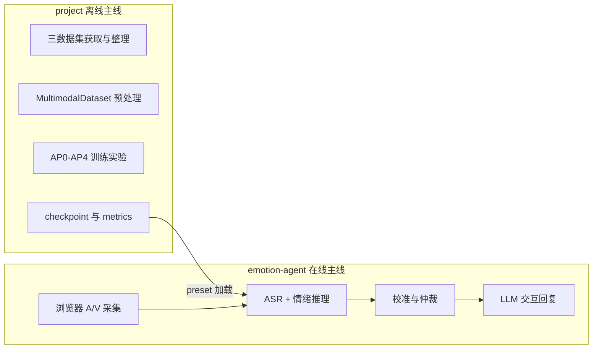

# 多模态情感分析智能体 — 系统架构总览

**版本**：2026-06-04  
**范围**：`project/`（离线训练与模型） + `emotion-agent/`（在线智能体）  
**配套架构图**：[`figures/system_architecture_figure.html`](figures/system_architecture_figure.html)（论文/答辩用）  
**本地查看远程 HTML**：[`VIEW_ARCHITECTURE_FIGURE.md`](VIEW_ARCHITECTURE_FIGURE.md)（端口转发 / SSH / 下载）  
**分图与总图关系说明**：[`figures/thesis/index.html`](figures/thesis/index.html)（浏览器打开，需端口转发 8765）  
**关联文档**：
- [`EMOTION_ACCURACY_AUDIT_AND_ROADMAP.md`](EMOTION_ACCURACY_AUDIT_AND_ROADMAP.md)
- [`EMOTION_AGENT_ENGINEERING_PLAN.md`](EMOTION_AGENT_ENGINEERING_PLAN.md)
- [`emotion-agent/docs/ARCHITECTURE.md`](../../emotion-agent/docs/ARCHITECTURE.md)
- [`EXPERIMENT_ACCURACY_SEQ_MAIN_RECORD.md`](EXPERIMENT_ACCURACY_SEQ_MAIN_RECORD.md)

---

## 1. 工作脉络总览

本课题实现 **「离线多模态情感模型研究 + 在线人机交互智能体」** 两条主线，共享同一套 7 类情绪标签与 checkpoint 权重。



| 阶段 | 目录 | 核心产出 |
|------|------|----------|
| 数据层 | `project/data/`、`project/scripts/organize_*.py` | CREMA-D / MELD / CMU-MOSEI 统一目录 |
| 模型层 | `project/models/` | ResNet50 + Wav2Vec2 + BERT + 融合模块 |
| 实验层 | `project/config/rerun/accuracy_plan/` | AP0–AP4 消融与 checkpoint |
| 推理层 | `project/utils/emotion_inference_service.py` | GPU 前向 + 时序多窗 |
| 智能体层 | `emotion-agent/` | FastAPI 编排 + React UI + ASR + LLM |
| 部署层 | `emotion-agent/deploy/` | nginx / systemd / tmux / Cloudflare |

---

## 2. 多模态情感分析模型架构（project）

### 2.1 整体数据流

```
原始样本 (video, audio, text, label)
    ↓ MultimodalDataset (data/dataset.py)
    ↓ 特征提取 (models/feature_extractors.py)
    ↓ 融合模块 (attention / emotion_shift / leader_follower / two_stage)
    ↓ 池化 + 分类头 + 回归头
    ↓ 7 类概率 + valence/arousal
```

### 2.2 模态与骨干网络

| 模态 | 骨干 | 输入 | 输出维 | 实现文件 |
|------|------|------|--------|----------|
| 视频 Video | ResNet-50 (ImageNet) | 4×112×112 RGB 帧 | 512 | `feature_extractors.py` |
| 音频 Audio | Wav2Vec2-base | 3s @ 16kHz 波形 | 512 | 同上 |
| 文本 Text | BERT (uncased / chinese) | token ids ≤128 | 512 | 同上 |
| 生理 Physio | 1D-CNN + LSTM | 64 维序列 | 512 | 同上（实验默认关闭） |

**在线特例**：CMU-MOSEI 训练可用 `.npy` 预提取特征（OpenFace2）；Agent 在线使用 **ResNet 抽帧**，故部署优先 **MELD（mp4）** 权重。

### 2.3 融合策略与对应论文

| 策略 | 论文来源 | 实现 | 混合 val Best F1 | 部署建议 |
|------|----------|------|------------------|----------|
| `emotion_shift` | CFN-ESA (arXiv 2307.15432) | `emotion_shift.py` | **0.562** (AP2_M1) | 三混合主推荐 |
| `leader_follower` | ICCV 2021 Leader-Follower | `leader_follower_attention.py` | 0.525 (audio leader) | 单域声学优先 |
| `standard` | 基线 cross-attention | `attention_modules.py` | 0.518 | 对照 |
| `two_stage` | GA2MIF (arXiv 2207.11900) | `two_stage_fusion.py` | 塌缩 | **禁止** |
| FMC 预训练损失 | MFMC (arXiv 2512.23076) | `functional_correlation.py` | 可选 | 主实验多关闭 |
| 域适应 DA | DANN 风格 | `domain_adaptation.py` | AP4 w=0.05 ≈0.528 | 可选 |

### 2.4 输出空间

**7 类统一标签**（`dataset.py` → `STANDARD_EMOTION_LABELS`）：

| id | 英文 | 中文 |
|----|------|------|
| 0 | happy | 开心 |
| 1 | sad | 难过 |
| 2 | angry | 生气 |
| 3 | fear | 害怕 |
| 4 | neutral | 平静 |
| 5 | anxious | 焦虑 |
| 6 | other | 其他 |

附加：**valence / arousal** 二维回归；可选 **trend** 预测头。

### 2.5 损失与训练

| 组件 | 文件 | 说明 |
|------|------|------|
| 训练入口 | `scripts/train.py` | pretrain / finetune 两阶段 |
| 分类损失 | `models/balanced_loss.py` | ClassBalancedLoss / FocalLoss |
| 采样 | `BalancedDatasetSampler` | proportional / uniform |
| 日志 | `logs_accuracy_seq/<run>/metrics.csv` | val Acc/F1/cls_ce_unweighted |
| 权重 | `checkpoints_accuracy_seq/<run>/` | best_f1 / best / epoch_* |

---

## 3. 数据集与数据获取

### 3.1 三数据集对比

| 数据集 | 规模 | 来源场景 | 视频格式 | 文本 | 类别 | 组织脚本 |
|--------|------|----------|----------|------|------|----------|
| **CREMA-D** | ~7.4k | 实验室演员表演 | .flv | 占位/转录 | 6→7 映射 | `organize_crema_d.py` |
| **MELD** | ~13k | Friends 剧集对话 | .mp4 | 英文台词 | 7→7 映射 | `organize_meld.py` |
| **CMU-MOSEI** | ~3.2k | YouTube 真实视频 | .npy 特征 / 视频 | 英文转录 | 7→7 映射 | `organize_cmu_mosei_*.py` |

**下载脚本**：`download_crema_d.py`、`download_cmu_mosei_sdk.py`

### 3.2 统一数据目录结构

```
project/data/
├── train/
│   ├── video/    crema_train_00001.flv | meld_train_00001.mp4 | mosei_train_00001.npy
│   ├── audio/    *.wav
│   ├── text/     *.txt
│   └── labels/   第一行 emotion，第二行 valence,arousal
├── val/
└── test/
```

### 3.3 数据预处理（训练与推理对齐）

| 步骤 | 训练 (`dataset.py`) | 在线 (`video_frame_utils.py` + `emotion_inference_service.py`) |
|------|---------------------|------------------------------------------------------------------|
| 视频 | OpenCV 均匀抽 4 帧 → 112×112 | webm/mp4 解码或 JPEG 多帧序列 |
| 音频 | librosa 16kHz，3s pad/crop | WAV 16kHz mono，WebAudio 采集 |
| 文本 | BERT tokenizer max_len=128 | ASR 合并文本 + 同 tokenizer |
| 时序 | 单样本 3s 窗 | 长采集 → `temporal_inference.py` 多窗聚合 |

### 3.4 Agent 闭环数据（扩展）

- 目录：`data/agent_capture/`（见 README）
- 整理：`scripts/organize_agent_capture.py`
- 用途：浏览器录制微调，纠正 webcam + 中文域偏移

---

## 4. 实验体系 AP0–AP4

| 阶段 | 目标 | 代表 config | 关键结论 |
|------|------|-------------|----------|
| **AP0** | 三混合 + standard 基线 | `ap0_AVT_noDA_standard_full50_s3407.yaml` | 混合 val 低 |
| **AP1** | 单域上界 | `ap1_AVT_ES_{crema,meld,mosei}_only_s3407.yaml` | MOSEI Acc 0.72；MELD F1 0.54 |
| **AP2** | emotion_shift 配方消融 | `ap2_M1_effbatch8_ES_3ds_s3407.yaml` 等 | **混合 SOTA F1 0.562** |
| **AP3** | 融合策略消融 | `ap3_fusion_*_3ds_s3407.yaml` | two_stage 塌缩 |
| **AP4** | 域适应扫描 | `ap4_config_AVT_DA_w005_accuracy_seq.yaml` 等 | DA w=0.05 |

**启动**：`scripts/start_accuracy_seq_tmux.sh`、`train_meld_agent.sh`、`finetune_agent_chinese.sh`

---

## 5. 智能体系统架构（emotion-agent）

### 5.1 逻辑分层

```
┌─────────────────────────────────────────────────────────┐
│  表现层  React (frontend/dist) — 采集 / 结果 / 流水线监控  │
├─────────────────────────────────────────────────────────┤
│  编排层  FastAPI (backend/app) — routes / 会话 / WebSocket │
├──────────┬──────────────┬──────────────┬────────────────┤
│ ASR :9010│ Emotion GPU  │ LLM :11434   │ 后处理          │
│ faster-  │ project/     │ Ollama       │ 校准+仲裁       │
│ whisper  │ EmotionInf.  │ qwen2.5      │                 │
└──────────┴──────────────┴──────────────┴────────────────┘
```

### 5.2 在线推理六步流水线

| 步骤 | 名称 | 组件 | 输入 → 输出 |
|------|------|------|-----------|
| 1 | ingest | `routes.py` + upload | 浏览器 multipart/chunk → bytes |
| 2 | asr | `asr_service.py` → asr-local | WAV → 中文文本 + 置信度 |
| 3 | text_merge | `routes.py` | user_input ∨ asr_text → merged_text |
| 4 | emotion_model | `ModelRouter` → `EmotionInferenceService` | A/V/T → 7 类 probs + trace |
| 5 | asr_calibration | `asr_emotion_calibration.py` | 扁平概率/哈哈 → 修正 probs |
| 6 | arbitration | `emotion_arbitration.py` | model + ASR → **final_emotion_label** |
| 7 | agent | `llm_service.py` | final_label + probs + ASR → 回复话术 |

### 5.3 技术栈

| 层级 | 技术 |
|------|------|
| 前端 | React 18, Vite 5, MediaRecorder, WebAudio, WebSocket |
| 后端 | FastAPI, Uvicorn, Pydantic Settings |
| ASR | faster-whisper (CUDA, zh, small) |
| 情绪模型 | PyTorch, ResNet50, Wav2Vec2, BERT, EmotionShiftFusion |
| LLM | Ollama qwen2.5:7b-instruct |
| 部署 | nginx HTTPS, systemd, tmux, Cloudflare Quick Tunnel |

### 5.4 Checkpoint Preset

| preset | 场景 | checkpoint 来源 |
|--------|------|-----------------|
| **meld_only**（默认） | Agent mp4 管线 | AP1 MELD 单域 |
| ap2_m1 | 三混合对照 | AP2_M1 |
| agent_chinese | 中文 BERT 微调 | AP2 chinese agent |
| mosei_only | 实验（npy 域差） | AP1 MOSEI |

切换：`project/scripts/apply_deploy_preset.sh`

---

## 6. 部署拓扑

| 端口 | 服务 | 路径 |
|------|------|------|
| 443 / 80 | nginx → 8000 | `emotion-agent/deploy/nginx.conf` |
| 8000 | FastAPI + frontend/dist | `scripts/start_demo.sh` |
| 9010 | asr-local | `asr-local/start_server.sh` |
| 11434 | Ollama | `scripts/start_ollama.sh` |

一键演示：`scripts/start_all_demo.sh`（tmux session `emotion-demo`）

---

## 7. 架构图说明（对应 HTML 图）

配套文件 [`figures/system_architecture_figure.html`](figures/system_architecture_figure.html) 参照 LearnedSQLGen 论文图风格，分为三块：

| 子图 | 内容 |
|------|------|
| **(a) 离线训练** | 三数据集 → 预处理 → MultimodalEmotionModel → AP0–AP4 实验 → Loss/Metrics → Checkpoint |
| **(b) 在线推理** | 浏览器 → FastAPI → ASR/Model/LLM → 校准仲裁 → UI 与回复 |
| **(c) 推理示例** | 一次「录制→ASR→多窗推理→happy」的逐步数据流 |

**使用方式**：浏览器打开 HTML → 打印/截图 → 插入论文或答辩 PPT。

---

## 8. 修订记录

| 日期 | 摘要 |
|------|------|
| 2026-06-04 | 初版：系统脉络文档 + 配套 architecture figure HTML |
