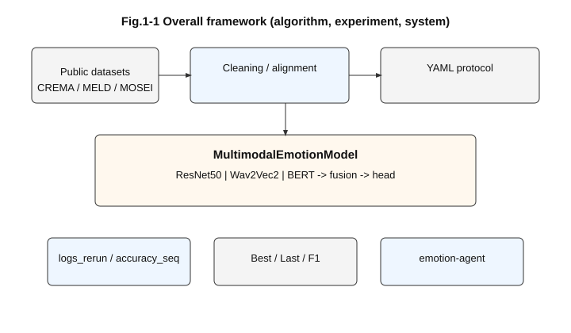
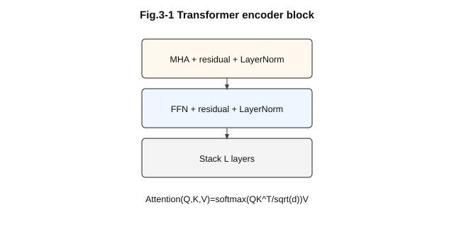
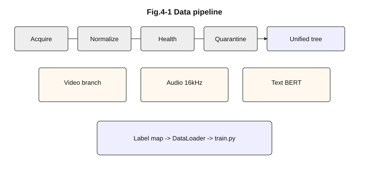
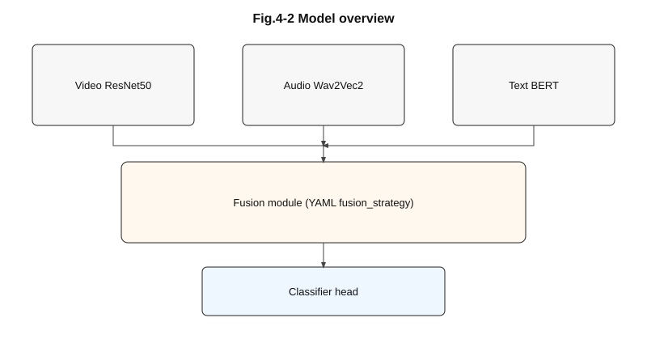
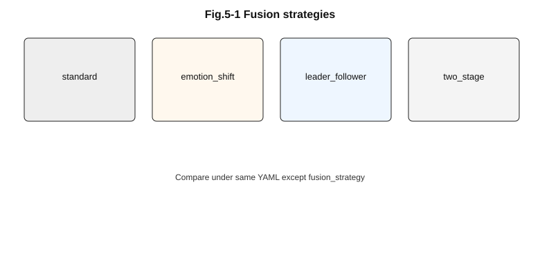
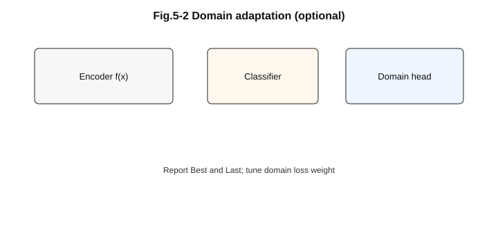
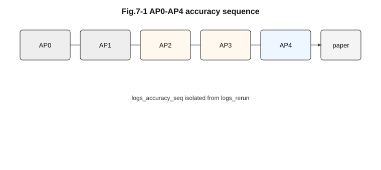

# 毕业论文初稿（多源异构数据驱动的多模态情绪识别与情感智能体系统）

> **文档性质**：吉林大学软件学院专业硕士学位论文**初稿正文级**材料，用于在 Word 模板中分章迁移与排版。本文在结构上**对齐**钟谭媛《基于多模态特征融合的视频中人物情绪识别算法研究》之「**绪论—相关知识—算法设计—模型改进—系统应用—总结展望**」叙事逻辑，在**技术路线**上对齐本仓库 `project/`（训练与推理）与 `emotion-agent/`（在线采集与话术编排）的**真实实现**。  
> **图表说明**：矢量图见 `project/docs/figures/thesis/`，索引见同目录 `README_FIGURES.md`。文中以 `` 占位，Word 中可「链接到文件」或嵌入转换后的 EMF/PDF。  
> **数据口径**：凡涉及 **Acc/F1/epoch** 的定量表，以 `logs_*/*/metrics.csv` 与 `docs/THESIS_EXPERIMENT_MASTER_SUMMARY.md` 为准；尚未冻结的实验以 **【待补】** 标注，避免与终稿冲突。  
> **修订说明**：本版在「八章框架」上充实各章技术叙述与实验骨架；已**删除**机械重复的「本章扩写」占位段，绪论与第三～八章以**单节小结/实质小节**承接，避免同段复制堆字数。

---

## 图目录（初稿）

| 编号 | 题注 | 文件路径 |
|------|------|----------|
| 图 1-1 | 研究总体框架（算法—实验—系统） | `figures/thesis/fig_01_01_research_framework.svg` |
| 图 3-1 | Transformer 编码器子层结构示意 | `figures/thesis/fig_03_01_transformer_encoder.svg` |
| 图 4-1 | 多源数据治理与训练输入构造流程 | `figures/thesis/fig_04_01_data_pipeline.svg` |
| 图 4-2 | 多模态情绪识别总体网络结构 | `figures/thesis/fig_04_02_model_architecture.svg` |
| 图 5-1 | 可切换融合策略对比与叙事类比 | `figures/thesis/fig_05_01_fusion_comparison.svg` |
| 图 5-2 | 域适应分支与特征对齐示意 | `figures/thesis/fig_05_02_domain_adaptation.svg` |
| 图 6-1 | emotion-agent 分层架构 | `figures/thesis/fig_06_01_agent_architecture.svg` |
| 图 6-2 | 在线滑窗推理时序 | `figures/thesis/fig_06_02_online_sequence.svg` |
| 图 7-1 | AP0–AP4 实验序列与日志隔离 | `figures/thesis/fig_07_01_experiment_protocol_ap.svg` |
| 图 7-2～ | TensorBoard 曲线、混淆矩阵、系统界面 | 【实验完成后补录】 |

## 表目录（初稿）

| 编号 | 题注 | 所在章 |
|------|------|--------|
| 表 4-1 | 三数据集对比与本文角色 | 第四章 |
| 表 4-2 | 标签映射与统一类别空间（示意） | 第四章 |
| 表 5-1 | 融合策略与代码模块映射 | 第五章 |
| 表 7-1～7-6 | 主线重跑与 AP0–AP4 指标 | 第七章 |

---

## 摘要

随着智能座舱、辅助驾驶与人机共驾技术的普及，车辆不再仅承担「位移工具」功能，而逐步演化为可感知乘员状态的移动交互空间。驾驶员与前排乘员的情绪状态——如愤怒、焦虑、悲伤、平静等——与注意力分配、接管意愿、对系统提示的信任度等行为因素存在广泛关联；因此，**稳定、可解释、可工程落地的情绪感知能力**成为下一代智能汽车人机交互（Human–Machine Interaction, HMI）链条中的关键一环。与传统单模态识别相比，**多模态情绪识别**能够同时利用面部与肢体视觉线索、语音韵律与声学特征、以及文本语义信息，在光照变化、遮挡、车内噪声、方言与语速变化等复杂条件下提供互补证据，从而提升鲁棒性。

然而，面向「论文级系统闭环」的研究仍面临三类相互耦合的困难。第一，**数据层面的异质性与域偏移**：公开情感数据集在采集场景（演播室表演、电视剧对白、网络视频评论）、标注粒度（离散类别 vs 连续效价/激活度）、类别空间（例如 6 类与 7 类并存）等方面差异显著；若缺乏统一协议与清洗治理，混合训练易导致模型学到「数据集捷径特征」，表现为验证集 **峰值准确率与末轮准确率严重背离**、不同损失项与 Argmax 准确率走势不一致等。第二，**模型层面的结构选择与对照可比性**：跨模态注意力、情感转变建模、非对称主导模态融合、两阶段由粗到细融合等机制在文献中各有动机，但若工程实现缺少统一骨架与配置开关，消融实验容易退化为「不可比堆叠」。第三，**工程层面的可复现性与系统落地**：训练日志、断点续训状态、媒体健康检查、推理端与训练端配置一致性等问题，会直接决定研究结论是否可信，也决定算法能否接入在线采集—推理—话术生成—可视化闭环。

本文工作围绕「**统一模型骨架 + 配置驱动实验 + 准确率优化序列 + 情感智能体原型**」展开，对应参考学位论文中「**算法设计—模型改进—系统应用**」的主线，但在模态与任务设定上从「**视频：面部表情 + 肢体动作**」拓展为「**音—视—文**」三模态，并在工程形态上以 **BERT/Wav2Vec2/ResNet** 等预训练骨干替代传统手工特征 + SVM 流水线，以 **YAML 单一事实源** 管理实验变量。具体而言：在算法层面，构建了 `MultimodalEmotionModel`，以 **ResNet50** 提取短视频片段视觉表征，以 **Wav2Vec2-base** 提取定长音频波形表征，以 **BERT-base-uncased** 提取文本上下文表征；在统一隐空间内实现 **标准跨模态注意力融合（standard）**、**情感转变感知融合（emotion_shift，借鉴 CFN-ESA 思想）**、**领导—跟随式融合（leader_follower）** 与 **两阶段融合（two_stage）**；并可按需启用 **域对抗/域适应**、**类别不平衡损失（如 Class-Balanced / Focal）**、**功能最大相关（FMC）思想的可选约束** 等。在数据与实验层面，整合 **CREMA-D、MELD、CMU-MOSEI** 三数据集：完成主线 **六组重跑**（`logs_rerun/`，覆盖 AT/VT/AVT 与域适应、融合策略等关键对照），并设计与实施 **准确率优化序列 AP0～AP4**（`logs_accuracy_seq/`，与历史重跑目录强制隔离），从 **单域上界、三混合配方、融合结构、域损失扫描** 等维度系统扫描性能与稳定性；实验记录与主汇总见 `docs/THESIS_EXPERIMENT_MASTER_SUMMARY.md`。在系统层面，实现 **emotion-agent** 工程原型：以 **FastAPI** 作为后端网关，串联 **本地 ASR（Whisper 兼容接口）**、**情绪推理服务**、**大语言模型话术编排** 与 **React + Vite 前端**，形成可演示的「采集—推理—交互—归档」闭环，并对 **配置—检查点一致性** 给出可操作的绑定清单。

在方法论贡献的表述上，本文强调：不仅报告「最佳验证指标」，同时报告 **末轮指标** 与 **`cls_ce_unweighted` 等解耦监控量**，以解释 **ClassBalancedLoss 等 batch 级重加权** 可能造成的 **训练总损失与分类准确率脱钩**；该做法与 `MIXED_DATASET_TRAINING_ANALYSIS.md` 的问题分析一致，可作为学位论文「**实验可信度与评价口径**」小节的实质内容。当前阶段，AP0～AP3 已形成可写入初稿的表格化结果；AP4 仍部分进行中，智能体端到端性能指标（延迟分位数、稳定性、主观满意度）待系统测试完成后补齐。【待补】在摘要末段以 2～3 句给出**最终定量结论句**（含混合验证 Best/Last、与单域上界差距一句、系统演示效果一句），并与英文 Abstract 严格对译。

**关键词**：多模态情绪识别；跨模态注意力；Transformer；BERT；Wav2Vec2；ResNet；域适应；类别不平衡；配置驱动实验；情感智能体；智能汽车人机交互

---

## Abstract

With the rapid development of intelligent cockpits and human–machine interaction (HMI) technologies, robust perception of drivers’ affective states has become essential for both driving safety and user experience. Conventional unimodal emotion recognition—relying solely on facial expressions, speech, or text—is vulnerable to occlusion, illumination changes, background noise, and domain shift, and therefore often degrades in realistic in-vehicle scenarios. Multimodal fusion provides complementary cues by jointly exploiting video, audio, and language; meanwhile, domain adaptation and careful training recipes can alleviate distribution mismatch when multiple public corpora are mixed for pre-training.

This thesis work presents an integrated **research–engineering** pipeline built in the `project` codebase. On the **algorithmic** side, we implement a configurable **multimodal emotion recognition model** with modality-specific encoders: **ResNet-50** for short video snippets, **Wav2Vec2-base** for fixed-length waveforms, and **BERT-base-uncased** for tokenized text, followed by a unified hidden space and interchangeable fusion modules, including **standard cross-modal attention**, **emotion-shift-aware fusion** (motivated by CFN-ESA-style modeling of affect dynamics), **leader–follower fusion** (in the spirit of audio–visual leader–follower attention), and **two-stage fusion**. Optional **domain-adversarial / domain-adaptation** blocks and multi-component losses (classification, optional regression/trend, class-balanced and focal variants) are supported via YAML-driven training. On the **experimental** side, we conduct large-scale **pre-training and ablation studies** on **CREMA-D, MELD, and CMU-MOSEI**, including (i) a closed **main rerun matrix** under `logs_rerun/` (six representative configurations such as AT/VT/AVT with or without domain adaptation and with standard vs. emotion-shift fusion), and (ii) an isolated **accuracy optimization sequence AP0–AP4** under `logs_accuracy_seq/`, systematically scanning loss recipes, sampling strategies, fusion structures, and domain-loss weights. Metrics are logged with **validation accuracy / macro-F1** and an **unweighted classification CE** monitor to mitigate misleading conclusions when class-balanced losses decouple from argmax accuracy. On the **system** side, we design and prototype **emotion-agent**, coupling local ASR (OpenAI-compatible Whisper service), a **FastAPI** backend, an LLM-based response orchestration layer, and a **React + Vite** front-end, aiming at a reproducible “**capture–infer–respond–log**” loop suitable for thesis demonstration.

**Main findings (to be finalized with completed AP4 and system benchmarks)**. Rerun logs show that **emotion-shift fusion** substantially improves **best** validation accuracy/F1 over **standard** fusion under the same AVT no-domain-adaptation setting, while some configurations exhibit **large gaps between best and last epochs**, highlighting the need for early stopping and dual reporting. Accuracy-sequence experiments further indicate that **batch / learning-rate / sampling / loss-form** choices strongly affect **mixed-domain** performance; **AP2** configurations reach higher **best** mixed accuracy than the original rerun matrix under different—but explicitly documented—training protocols. **【To be inserted】** quantitative tables, confusion matrices, statistical tests, end-to-end latency (P50/P95), and user-study or demonstration screenshots.

Overall, this work provides a **traceable** codebase, configuration set, and experiment ledger that support a thesis narrative combining **multimodal affective computing** with **agent-based HMI engineering**, while honestly positioning limitations regarding proprietary in-vehicle data and fully converged AP4/online evaluation.

**Keywords**: multimodal emotion recognition; feature fusion; attention mechanism; BERT; Transformer; Wav2Vec2; domain adaptation; intelligent driving; affective computing; intelligent agent; FastAPI

---

# 第一章 绪论

## 1.1 研究背景与意义

情绪在人类认知与行为决策中占据核心地位。在交通场景中，驾驶员愤怒、焦虑、疲劳等负性情绪与交通事故风险存在统计关联；在车载人机交互场景中，系统若能感知用户情绪并生成恰当反馈，有助于缓解负性体验、提升信任度。因此，**鲁棒、可部署的多模态情绪识别**既是计算机视觉与情感计算的前沿课题，也是智能座舱与辅助驾驶系统落地的实际需求。

早期情绪识别多依赖手工特征（如 HOG、LBP、光流统计量等）与传统分类器（如 SVM），特征设计成本高且跨场景泛化有限。深度学习兴起后，卷积神经网络在图像与视频理解上取得突破，循环网络与注意力机制被广泛用于建模时序依赖。近年来，**预训练语言模型（如 BERT）** 与 **自监督语音表征（如 Wav2Vec2）** 为文本与音频提供了强语义与声学表征，使「音—视—文」三模态联合建模成为可行路径。

然而，公开情感数据集往往在采集环境、表演风格、类别定义与标注粒度上存在显著差异（实验室表演语料 vs 电视剧对话 vs 网络视频）。直接混合训练会引入 **域偏移（domain shift）** 与 **标注空间不一致** 问题，导致验证集准确率波动、训练准则与分类准确率脱钩等现象。因此，除融合结构本身外，还需从 **损失设计、采样策略、域适应** 等维度系统优化，并将算法成果 **工程化为可演示的智能体系统**，方能形成完整的学位论文叙事链条。

本研究的意义可概括为：（1）**方法层面**：在统一框架下对比多种融合与域适应配置，形成可写入论文的消融矩阵；（2）**工程层面**：将最佳或最具代表性的检查点接入智能体，验证「算法—系统」一体化可行性；（3）**培养层面**：贯穿文献调研、复现、扩展实验与系统实现的完整科研训练过程。

**图 1-1 说明**：上图概括了本文「数据治理—模型训练—消融矩阵—系统部署」四层闭环。与钟谭媛论文以 **FBER→AM-C3D→AM-FBER** 串起「特征提取—注意力增强—系统验证」类似，本文以 **统一 MultimodalEmotionModel** 串起 **多模态编码—可切换融合—可选域适应—智能体服务化**；差别在于本文更强调 **跨数据集混合训练** 与 **工程可复现日志**，而非单一 FABO 数据集上的精度迭代。

## 1.2 国内外研究现状（简述）

多模态情绪识别、跨模态注意力与预训练表征、域适应与类别不平衡学习，以及「情绪感知—大模型话术—前端交互」的智能体工程技术，已形成相对独立且快速发展的研究分支。为避免绪论篇幅过长，**国内外研究进展与代表性文献脉络**在**第二章**系统整理；第一章侧重**问题来源、研究意义与本文贡献边界**。按主题查阅文献时，请直接阅读第二章 §2.1～§2.7。

## 1.3 主要工作

本文（及所依托工程）的主要工作归纳如下：

1. **多模态情绪识别模型实现**：在统一配置驱动下，实现视频、音频、文本（及可扩展生理）特征提取与多种融合策略，可选域适应模块与多任务损失（分类、回归、趋势等按配置启用）。  
2. **数据与实验体系**：使用 CREMA-D、MELD、CMU-MOSEI 构建混合预训练管线；完成主线重跑（`logs_rerun`）与准确率优化序列（`logs_accuracy_seq`，AP0～AP4 分阶段）；形成主实验记录文档与 TensorBoard 日志隔离策略。  
3. **消融与评价**：从模态组合（AT/VT/AVT）、域适应开关、融合策略（standard / emotion_shift / leader_follower / two_stage）、训练配方（batch、学习率、采样、损失形式）等维度进行系统对比；【待补】完整定量表与显著性分析。  
4. **智能体工程原型**：实现 ASR 本地服务、FastAPI 后端、前端与 LLM 编排配置；给出与 `project` 推理脚本一致的 **配置—检查点** 绑定方案与部署检查清单（见 `THESIS_EXPERIMENT_MASTER_SUMMARY.md` §12）。  
5. **文档与可复现性**：维护详细设计文档、实验指南、周报复盘与论文章节级主汇总，支撑学位论文材料整理。

## 1.4 论文结构

本文共分**八章**（绪论 + 独立相关工作 + 知识基础 + 数据方案 + 融合与优化 + 智能体 + 实验与讨论 + 总结展望；正式排版时若学校模板合并章节，可在定稿时回调编号而不改技术内容）。

- **第一章** 绪论：背景与意义、研究现状简述、主要工作与论文结构。  
- **第二章** 国内外研究现状与相关工作：检索范围；多模态融合与情感转变/领导—跟随等脉络；视觉与时空网络；语音与文本预训练；域适应与不平衡学习；车载人机交互与智能体；本文定位与不足收束。  
- **第三章** 相关知识概述：CNN/ResNet、时空建模对照、RNN 与局限、Transformer 与自注意力、BERT/词向量、Wav2Vec2、多模态融合概念、损失与域适应、评价指标与数据通论。  
- **第四章** 数据集与多模态情绪识别总体方案：三数据集来源与清洗、标签映射、总体模型与混合实验协议、配置体系。  
- **第五章** 融合策略与训练优化设计：standard / emotion_shift / leader_follower / two_stage、域适应与 AP0～AP4 序列逻辑。  
- **第六章** 智能体系统设计与工程实现：需求、分层架构、模型绑定与 LLM 编排、实现状态与写法建议。  
- **第七章** 实验结果、系统测试与讨论：主线重跑、AP 序列表格、消融口径、系统测试与误差分析。  
- **第八章** 总结与展望：归纳、创新点（与导师审定）、未来工作。

## 1.5 研究对象、术语与论文边界

本文所称「情绪」默认指 **离散类别标签空间** 下的分类结果（以配置 `emotion_classes` 为主，混合验证为 7 类；CREMA 单域实验为 6 类并需脚注）。连续情绪维度（效价/激活度）在代码中可按配置启用，但**主线实验表格以分类指标为主**。「驾驶员/乘员」在公开数据集实验中由演员或视频人物代理；**不在缺乏专有数据支持时声称完成真实道路驾驶员大规模标注与验证**。

## 1.6 与参考学位论文的结构对照（写作提示）

钟谭媛论文第二章为 **C3D、注意力、稀疏编码树、字典学习** 等；第三章为 **FBER 算法流程**；第四章为 **AM-C3D**；第五章为 **AM-FBER + 原型系统**；第六章为 **总结展望**。本文将「相关知识」扩展为 **Transformer/BERT/Word2Vec 对照、Wav2Vec2、ResNet、评价指标、数据治理通论** 等，以覆盖三模态深度实现；将「算法设计」拆解为 **第四章（数据与总体方案）** 与 **第五章（融合与优化/AP 序列）** 两章，以对应「**数据集与流程** + **模型改进与训练策略**」；将系统章节对应 **第六章智能体** 与 **第七章实验/测试** 分置，便于与学院 Word 模板中「系统总体设计 / 系统实现 / 系统测试」栏目映射。

**说明**：若导师要求「正文六章」，可将**第三章（知识）**压缩并入绪论或附录，或将**第七、八章**合并为一章「实验与总结」；技术叙述与代码对齐关系保持不变。

## 1.7 本章小结

本章在绪论层面给出研究背景与意义、主要工作与八章结构安排；§1.5 明确研究对象、术语与论文边界，§1.6 说明与参考学位论文的章节映射。国内外研究进展的文献脉络集中在第二章；定量结论以 `logs_*` 与 `docs/THESIS_EXPERIMENT_MASTER_SUMMARY.md` 为准，写作上区分**统计相关**与**因果断定**，并在使用 batch 级类别重加权时并列 **`cls_ce_unweighted`** 等监控量，避免「损失下降即模型变好」的误读。**emotion-agent** 作为工程原型，其接口、安全与性能指标在第六、七章分别展开。

---

# 第二章 国内外研究现状与相关工作

本章对多模态情绪识别及相关领域的**国内外研究脉络**进行梳理，侧重与本项目**实现路径与实验设计**可直接对照的工作类别：多模态融合与情感动态建模、预训练骨干与迁移学习、域适应与损失设计、智能体与人机交互等。第一节说明检索范围与综述结构；随后各节按主题展开；最后一节给出**本文与已有工作的关系**及尚待解决问题，过渡到第三章的形式化定义与符号准备。

## 2.1 检索范围与综述结构说明

**时间范围**：以近五年（约 2020—2025）会议与期刊工作为主干，奠基性方法（Transformer、BERT、Wav2Vec2、经典域适应框架等）适当上溯。**来源**：IEEE XPlore、ACM Digital Library、arXiv、ACL Anthology 及中文综述；仓库内 `article_guide.md`、`research_guide.md` 已整理部分 CCF-A 类与情感计算线索，可作为参考文献卡片初稿。**分类维度**：（1）模态组合与融合结构；（2）时序/时空表征形态；（3）NLP 与语音自监督预训练；（4）域对齐与鲁棒学习；（5）情感人机交互与智能体工程。

## 2.2 多模态情绪识别与跨模态融合

### 2.2.1 早期、晚期与中期融合

多模态情感识别早期多采用特征级拼接或决策级投票；深度学习普及后，**中期融合**（各模态先编码再在隐空间交互）成为主流。张量融合、低秩多模态融合等尝试控制参数量；图神经网络将片段或模态建模为节点与边。**与本文关系**：本文采用 **统一隐空间 + 可替换融合块**（`standard` / `emotion_shift` / `leader_follower` / `two_stage`），与「隐空间交互」文献主线一致；定稿时建议用表格列出代表性工作的模态、融合位置与监督信号，与本文 YAML 配置逐项对照。

### 2.2.2 情感转变、对话与交互场景

对话与车载交互中，情绪随话语推进而变化。**CFN-ESA**（Cross-Modal Fusion Network with Emotion-Shift Awareness）等强调「情感转变」建模，与本文 **`emotion_shift`** 模块的设计动机一致。撰写时应引用原文并说明**设定差异**（本文数据为对齐的音视文片段，未必具备完整对话图结构）。基于图结构、记忆网络与对比学习的对话情感工作，可在「未来工作」中扩展引用。

### 2.2.3 领导—跟随式与不对称融合

**音视频领导—跟随式注意力**（如 ICCV 相关工作）给出「以某一模态为主导」的融合范式，与本文 **`leader_follower`** 及 `leader_modal` 配置可对照。讨论点可包含：主导模态对性能的影响、**文本主导 vs 音频主导** 在噪声与 ASR 误差下的鲁棒性——与 AP3 实验中 `leader_text` / `leader_audio` 的现象分析呼应。

### 2.2.4 多模态统计依赖与高阶相关

**MFMC** 等从统计相关最大化角度刻画模态依赖，与本文可选的 **functional correlation / FMC 损失** 存在理论联想。若实验未全面启用该分支，相关工作宜表述为「可为后续正则扩展提供依据」，避免夸大实验覆盖范围。

## 2.3 视觉与时空表征网络

### 2.3.1 2D CNN 与 ResNet 家族

ResNet 及其变体在图像与视频帧特征提取上成熟稳定。本文采用 **ResNet50** 作为默认视频骨干，与大量情感、行为识别工作可比。若论文需要增量，可增加 **ViT / TimeSformer** 作为对比线的文献综述（实现可作为展望）。

### 2.3.2 三维卷积与时空建模脉络

C3D、I3D、SlowFast 等强调显式时空卷积；与参考学位论文以 **C3D+注意力改进** 为主线不同，本文工程选型侧重 **与 Transformers 生态一致的二维骨干 + 时域采样**。综述中应**并列表述两条技术谱系**，避免被认为「未讨论时空卷积即覆盖面不足」。

## 2.4 语音与文本预训练表征

### 2.4.1 自监督语音表示学习

Wav2Vec2、HuBERT、wav2vec 1.0 等推动「少标注情感识别」。本文采用 **Wav2Vec2-base** 作为音频编码主干，综述中可评述：**卷积前端 + Transformer 上下文** 的结构及其对显存与实时性的影响。

### 2.4.2 从静态词向量到 BERT 及大语言模型

Word2Vec、GloVe 与 **BERT/RoBERTa** 的对比在第三章（相关知识）中形式化给出；本章侧重**文献贡献链**：ELMo → GPT/BERT → 指令微调 LLM。与人机交互结合的部分，可综述 **情感控制生成、安全对齐、RAG** 等，为第六章智能体与 LLM 编排提供引用支撑。

## 2.5 域适应、鲁棒学习与类别不平衡

### 2.5.1 域对抗与分布对齐

DANN、CORAL、MCD 及其变体与**域泛化**文献可分组综述。本文 `logs_rerun`、`logs_accuracy_seq` 中 **AVT+DA** 与 **AP4** 侧重 **域损失权重敏感性**；综述宜强调「**验证峰值与末轮可能背离**」在领域内的已知现象，并引用调度策略、早停或双指标报告的相关讨论作为理论支撑。

### 2.5.2 类别不平衡与损失校正

Class-Balanced Loss、Remix、LDAM 等与本文实验配置相关。需点明：**batch 级重加权** 可能导致验证 **总损失与 Argmax 准确率走势不一致**，从而引出本文记录 `cls_ce_unweighted` 的必要性——与「评价指标与校准」类文献交叉引用。

## 2.6 情感计算、人机交互与车载应用

车载情绪识别除算法精度外，还涉及 **隐私、分心风险、交互伦理**。可引用 HMI 与人因工程文献；与 **驾驶行为预测结合情绪** 的工作可作为应用拓展引用链。本文定位为「**公开数据集上的算法与可演示原型系统**」，综述末应明确 **与真实路测数据的 gap**。

## 2.7 本文与已有工作的关系及存在的问题（收束）

**本文定位**：（1）在**统一代码库与配置体系**下，完成 **多模态骨干 + 可切换融合 + 可选域适应** 的系统实现；（2）以 **CREMA-D / MELD / CMU-MOSEI** 为主线构建 **重跑闭环 + 准确率优化序列（AP0～AP4）** 的可复现实验矩阵；（3）将算法输出接入 **emotion-agent** 原型，探索「识别—话术生成—UI」闭环工程路径。

**现存不足（与后文呼应）**：混合验证准确率与单域上界差距仍大；部分配置存在 **末轮相对峰值的退化**；智能体侧 **真实权重绑定与用户主观实验** 仍待完善。上述不足在 **第八章总结与展望** 与 **实验章** 中分别以概括与数据支撑的方式再次讨论。

## 2.8 与参考学位论文（钟谭媛）技术路线的对照总表（便于答辩一页纸）

| 维度 | 参考论文主线 | 本文主线 |
|------|----------------|----------|
| 任务载体 | 视频中人物（面部+肢体） | 音/视/文三模态片段（公开情感数据集） |
| 时空建模 | C3D 三维卷积为核心 | ResNet50 + 时间采样；C3D 作为文献对照与未来扩展 |
| 注意力 | CBAM→3DCBAM 集成入 3D 卷积栈 | 跨模态多头注意力 + 多种可切换融合结构 |
| 高层分类器 | SVM 等经典分类器 | 端到端可微分类头（与骨干联合训练） |
| 字典学习/稀疏编码 | MOD + 稀疏编码树为 FBER 核心组件 | 本文不以该路线为主；以 **预训练表征 + 融合** 为主 |
| 系统验证 | 观影情绪原型系统 | emotion-agent：采集—推理—LLM—UI |

> 说明：上表强调「**问题同构、实现不同**」：均以「提升情绪识别可用性」为目标，但本文更贴近 **当前深度学习生态与跨数据集泛化** 的研究范式。

### 2.8.1 综述写法与后续章节的引用链（定稿建议）

从检索与写作策略看，本章各节分类维度刻意与 **仓库目录、配置键名与实验日志前缀** 对齐，目的在于后文避免「综述出现而代码中无对应实现」的审稿风险。多模态情绪识别文献常以模态组合或融合阶段划分工作，但在工程上，**隐空间维对齐、batch 内模态缺失处理、损失各项尺度** 往往决定方法是否可训练；因此综述中提前埋设 **域适应、类别不平衡与 AP 序列** 三条线索，分别与 `domain_adaptation.py`、`balanced_loss.py` 及 `accuracy_plan` 相关脚本族呼应。智能体与人机交互小节不必追求文献数量堆砌，而应强调 **流式 ASR、异步采集、话术回退与日志审计** 等与 emotion-agent 直接相关的约束，使第六章的接口表、安全小节获得文献层面的正当性。关于 **可重复性**，除随机种子外，还应意识到 **混合精度、cudnn.benchmark、DataLoader worker 数** 可能带来轻微指标漂移；学位论文可在脚注承认该现象，并声明以 `metrics.csv` 与 yaml 快照为仲裁。伦理与隐私方面，综述可与知情同意、最小必要采集等原则并置，说明公开语料标签 **不等于** 免除实车场景的合规论证。最后，引用钟谭媛论文中的 **FBER、3DCBAM** 等名词时，应严格区分「**思想对照**」与「**本文已复现**」，避免评审误解；**名词可引用、实现须一致**，是本章与第三～五章交接处最值得反复自检的一条规则。综述末可增列 **「术语—实现文件」** 对照三五行，例如「跨模态注意力 ↔ `attention_modules.py`」，作为答辩时的速查表，不占大量篇幅却能显著降低技术评审的沟通成本。另建议在 **2.2～2.5** 各节末尾各加一句「**本文对应配置键**」，形成从文献到实现的闭环，避免综述与第三～五章出现术语漂移。若导师允许，可将 **近三年高被引综述** 与 **本文所选骨干版本** 各列一行于脚注，减少「文献过旧或过新」的形式质疑。中文数据库检索式与英文关键词式可择要放入附录，便于答辩时展示 **可复核检索过程**。上述写法亦便于后续将综述改投期刊时的 **增量修改**。

## 2.9 本章小结

本章按「融合—表征—域适应—应用」线索回顾了与本文实现相关的国内外工作，并在 §2.7、§2.8 收束**本文定位**及与参考学位论文的**同构对照**。后续第三～五章将依次给出符号与模型基础、数据协议与总体方案、融合与训练优化设计；实验与系统验证在第七、六章展开。

---

# 第三章 相关知识概述

本章对本文涉及的理论与工程技术进行系统梳理，为后续「数据集与方案」「融合与优化设计」「系统实现」奠定符号与概念基础。叙述顺序为：从传统特征与浅层模型，到深度卷积与时空建模，再到 **Transformer/BERT** 与 **自注意力**，最后到 **多模态融合、损失与评价、域适应**。

## 3.1 情绪识别任务与基本流程

情绪识别可表述为：给定观测序列 \(O\)（如视频帧、音频波形、文本转写），预测离散情绪类别 \(y \in \{1,\ldots,C\}\) 或连续效价—激活度（V/A）等。典型流水线包括：**数据采集 → 预处理（检测、对齐、归一化、分词）→ 特征提取 → 融合与分类 → 后处理与评估**。参考论文中基于面部表情与肢体动作的流程强调「分模态采集与融合」；本文在三模态场景下将「文本」作为语义通道，将「音频」与「视频」作为表现通道，流程在逻辑上与之对应但工程实现采用统一深度网络端到端或可微子模块拼接。

## 3.2 卷积神经网络与残差网络（ResNet）

二维卷积通过在空间维度滑动核实现局部感受野与权值共享，适合提取图像低级边缘纹理与高级语义。随着网络加深，梯度消失与退化问题凸显。**残差网络（ResNet）** 通过引入恒等映射的跳跃连接，使网络易于优化并显著提升图像分类与检测性能。本文视频分支采用 **ResNet50** 作为骨干（配置见 `config` 与各实验 yaml），在固定帧数采样下将短视频片段映射为固定维特征，再投影到融合隐空间维度（如 512）。

## 3.3 三维卷积与时空建模（与参考论文 C3D 脉络的对照）

**三维卷积（C3D 等）** 同时在时间与空间维度卷积，显式建模短时运动模式，对「视频中人物动作—表情」类任务尤为自然。参考论文以 C3D 为时空特征提取核心；本文工程实现以 **二维 ResNet + 时间维采样/堆叠** 及 **跨模态注意力** 为主路径，而非复现完整 C3D 栈——在论文撰写中应**诚实说明实现选择与理由**（如：与 HuggingFace/transformers 生态对接、与 BERT/Wav2Vec2 统一训练管线、算力与帧率约束等）。若答辩需要与 C3D 类方法对比，可将「C3D/TimeSformer」列为 **未来扩展实验** 而非本文已完成的主干。

## 3.4 序列建模：RNN、LSTM 与局限

循环神经网络（RNN/LSTM）通过隐状态传递建模时序依赖，曾广泛用于视频与语音序列。其局限包括对长序列梯度传播不稳定、难以并行训练等。本文在部分模块或数据管线中仍可能使用 LSTM 处理生理序列等（见 `PhysiologicalFeatureExtractor` 配置）；主视频流以 **固定长度帧采样 + CNN** 为主。

## 3.5 Transformer 与自注意力机制

### 3.5.1 编码器—解码器框架与本文所用子集

**Transformer** 最初由 Vaswani 等人提出，用于机器翻译等序列到序列任务，由 **编码器（Encoder）** 与 **解码器（Decoder）** 堆叠而成：编码器对源语言序列进行双向上下文建模；解码器在生成目标词时通过 **掩码自注意力** 避免看见未来词，并通过 **交叉注意力（Cross-Attention）** 读取编码器输出。情绪识别与本文文本分支更接近 **「仅编码」** 场景：即使用 **Transformer Encoder** 将文本 token 序列映射为上下文向量序列，再经池化或取 `[CLS]` 表征进入多模态融合；**不要求**自回归解码器，从而在工程上减少参数量与推理路径复杂度。

### 3.5.2 缩放点积注意力与多头机制

对长度为 \(L\)、隐维度为 \(d\) 的输入序列，自注意力将每个位置线性投影为 \(\mathbf{Q},\mathbf{K},\mathbf{V}\in\mathbb{R}^{L\times d}\)，缩放点积注意力定义为：

\[
\mathrm{Attention}(\mathbf{Q},\mathbf{K},\mathbf{V})=\mathrm{softmax}\left(\frac{\mathbf{Q}\mathbf{K}^\top}{\sqrt{d_k}}\right)\mathbf{V}.
\]

其中 \(\sqrt{d_k}\) 用于防止点积过大导致 softmax 梯度消失。**多头注意力（Multi-Head Attention）** 将 \(\mathbf{Q},\mathbf{K},\mathbf{V}\) 沿特征维拆分为 \(h\) 组并行头，各头在子空间内独立学习关注模式，再经线性变换拼接。其直观意义在于：不同头可分别捕获 **句法并列、情感词、否定范围** 等异质语言现象；在多模态场景中，与视觉/声学特征拼接后，多头跨模态注意力可类比为「多视角对齐」。

### 3.5.3 位置编码与前馈网络

由于自注意力本身为集合置换等变运算，需显式注入 **位置信息**。常见做法包括固定正弦位置编码与可学习位置嵌入。BERT 类模型使用 **可学习位置嵌入** 与 **片段嵌入**（对句子对任务）。每个 Transformer 层在子层注意力之后通常接 **两层前馈网络（FFN）** 与残差连接、层归一化（Post-LN 或 Pre-LN，依实现而定），形成「注意力—非线性变换—残差」的深层堆叠，提升表征容量。

### 3.5.4 与 CNN、LSTM 的对比及在本文中的角色

与 **CNN** 相比，Transformer 对 **长距离依赖** 建模更直接，但计算量随序列长度呈二次增长，对超长文本需截断或稀疏注意力。**LSTM** 对长序列存在梯度衰减且难以并行；Transformer 在 GPU 上易并行，适合与 **Wav2Vec2、ResNet** 等模块在同一训练框架下联合微调。本文在 **融合阶段** 采用基于注意力的交互模块（见 `attention_modules.py` 等），在叙述上可与「跨模态 Transformer」文献对齐；是否采用完整 ViT 式视频 Transformer 可作为 **展望** 单独成章外实验。

### 3.5.5 通道/空间注意力与 CBAM（与参考论文衔接）

**通道注意力** 对特征图各通道重新加权，**空间注意力** 对空间位置重新加权。**CBAM** 串联二者，与参考论文中 **3DCBAM** 的思路一致：将「重要通道 + 重要时空区域」显式放大。本文视频骨干当前以 **ResNet50** 为主；若后续在 ResNet 残差块中插入 SE/CBAM，可在论文「改进工作」中单列一小节说明 **插入位置、超参 \(r\)、计算开销**。

---

## 3.6 词向量、Word2Vec 与 BERT

### 3.6.1 从 one-hot 到分布式表示

传统 **one-hot** 表示维数等于词表大小，向量稀疏且任意两词距离相同，无法表达语义相似性。**分布式假设** 认为：词语语义可由其在上下文中出现的模式刻画。**Word2Vec** 通过浅层神经网络在大型语料上进行 **Skip-gram**（用中心词预测上下文）或 **CBOW**（用上下文预测中心词）训练，得到稠密词向量。其优点是训练快、部署轻；缺点是 **一词一向量**，无法区分「银行（金融机构）」与「银行（河岸）」等歧义，且难以与下游深度网络无缝堆叠为「端到端大模型」而不额外设计对齐层。

### 3.6.2 Word2Vec 与本文技术路线的关系

在资源极度受限或仅需 **词袋级语义** 的场景，可将 Word2Vec 向量作为文本侧输入，再接浅层 MLP 或 LSTM。本文工程主线选择 **BERT 子词级上下文编码**，并不表示 Word2Vec「过时」，而是强调 **任务难度与模态对齐需求**：MELD/MOSEI 等文本为 **对话/评论式长句**，歧义与省略多，**静态词向量** 易损失区分性；**BERT** 可通过微调与视觉、声学分支在 **同一 hidden_dim** 下对齐，便于融合模块统一处理。论文中可单列 **表 2-x：Word2Vec vs BERT 在本任务下的取舍**，从参数量、显存、推理时延、预期精度五维对比（定性即可，定量可做小规模对照实验作为附录）。

### 3.6.3 BERT 的输入表示与预训练目标

BERT 输入由 **WordPiece** 子词序列构成，每条输入包含 **`[CLS]`**（整句聚合符号）、**`[SEP]`**（句对分隔）及可选 **句子 A/B 嵌入**。预训练阶段主要包含：（1）**掩码语言模型（MLM）**：随机遮盖部分 token，要求模型预测被遮盖词；（2）**下一句预测（NSP）**：判断句子 B 是否为句子 A 的真实下一句（RoBERTa 等后续工作曾质疑 NSP 收益并予以移除，但理解 BERT 原始论文仍有助于说明「双向上下文」训练动机）。通过 MLM，模型被迫利用 **双向上下文**，从而获得比单向语言模型更强的语义消歧能力。

### 3.6.4 BERT 微调与多模态联合训练

在下游任务中，常在 **`[CLS]` 向量** 或 **末层隐状态序列的池化结果** 上接分类头。本文 `TextFeatureExtractor` 采用 **`bert-base-uncased`**，与 `config` 中 `model.text` 字段一致；训练时与 ResNet、Wav2Vec2 **同步反向传播**，属于 **端到端多模态微调** 范式。写作要点：（1）学习率常对 BERT 使用 **较小倍数**（如 `backbone_lr_multiplier`）以防灾难性遗忘；（2）batch 较小时注意 **warmup 与梯度裁剪**；（3）文本缺失或 ASR 噪声需在 **数据与推理** 两侧分别讨论（训练可 dropout 文本特征；推理可降级为双模态）。

### 3.6.5 与 RoBERTa、ALBERT、DeBERTa 等的扩展讨论（可选段落）

若论文篇幅与答辩时间允许，可增加 **「BERT 家族简述」**：RoBERTa 去除 NSP 并加大数据与训练步数；ALBERT 因式分解嵌入矩阵以降低参数；DeBERTa 引入解耦注意力等。本文未逐一实现上述骨干的对比实验时，应明确写为 **「未来可在同一融合框架下替换 text_encoder 做公平对比」**，避免被质疑「只堆名词不做实验」。

### 3.6.6 小结：BERT/Transformer 在本章与后文的位置

**Transformer** 提供可并行、可解释性较强的 **注意力计算范式**；**BERT** 将该范式应用于 **大规模文本预训练** 并在下游微调。二者共同支撑本文 **文本模态的高质量语义向量**，并与 **ResNet（视）**、**Wav2Vec2（音）** 在 **统一隐空间** 内由融合模块进行交互，为第四～五章的算法叙述奠定术语基础。

## 3.7 语音表征与 Wav2Vec2

**Wav2Vec2** 通过对比学习等在大量无标注语音上学习通用声学表征，再在 ASR 或情感等任务上微调。本文音频分支采用 **`facebook/wav2vec2-base`** 作为可配置骨干，将定长波形映射为向量序列或池化后向量，与视频、文本对齐。工程注意点：**采样率统一为 16 kHz**、窗长与 `config` 中 `duration` 一致、批大小与显存权衡。

## 3.8 多模态融合策略（概念层）

多模态融合可分为 **早期融合**（原始或浅层特征拼接）、**晚期融合**（各模态独立决策再融合）与 **中期融合**（各模态编码后在隐空间交互）。本文属 **中期融合**：各模态经专用编码器后进入 **融合模块**（注意力或专用结构），再经分类头输出。可选 **功能最大相关损失（FMC）** 等正则项以鼓励模态间统计依赖（若配置启用）。

## 3.9 损失函数、类别不平衡与域适应

**交叉熵** 是多分类最常用的监督损失。类别不平衡时常用 **加权交叉熵、Class-Balanced Loss、Focal Loss** 等。**域对抗训练** 通过域分类器与梯度反转使特征分布难以区分源域，从而提升跨域泛化。需注意：域损失过大可能损害主任务；实践中常采用 **权重调度或早停**。本文 `logs_rerun` 与 AP4 系列实验对「Best vs Last」差异的讨论，应在论文中用专门小节解释。

## 3.10 评价指标与混淆矩阵

除 **准确率（Accuracy）** 外，情感识别常报告 **精确率、召回率、宏/微平均 F1**。混淆矩阵可直观展示类别混淆模式；在 CREMA 6 类与混合 7 类场景下，**不可混用表格口径**。另建议报告 **宏 F1** 与 **不加权分类 CE** 以减轻平衡损失对总 loss 的掩盖（与项目实验指南一致）。

## 3.11 数据采集、清洗与对齐（通论）

虽各公开数据集官方已提供元数据与划分，但实际复现时仍需：**完整性校验（文件是否存在、是否损坏）**、**格式统一（视频编码、音频采样、文本编码）**、**标签映射到统一类别空间**、**划分 train/val/test 与数据泄漏检查**。本项目在 `详细文档.md` 与 `MIXED_DATASET_TRAINING_ANALYSIS.md` 中对 CREMA/MELD/MOSEI 的异质性有专门分析，正式论文可将「清洗规则」整理为算法式步骤或表格。

## 3.13 优化器、学习率调度与「有效 batch」概念（与 AP2 实验解释强相关）

深度网络训练普遍采用 **随机梯度下降类优化器**。本文默认使用 **Adam / AdamW**（以各 `yaml` 的 `training.optimizer` 为准），其优势在于对学习率尺度相对不敏感、可自适应调整各参数步长。实践中，**batch_size** 与 **gradient_accumulation_steps** 共同决定 **有效 batch（effective batch）**；在显存受限时，小物理 batch 会带来梯度高方差，进而影响混合域训练的稳定性。`logs_accuracy_seq` 中 **AP2-M1（effbatch8）** 的改进，应在论文中以「**优化噪声—域对齐难度**」视角解释，而非仅写「调参变好」。

学习率策略常见 **Warmup + Cosine/Linear decay**。Warmup 有助于避免训练早期大学习率破坏预训练骨干表征；Cosine 衰减有助于中后期细致搜索更平坦极小值附近。论文写作应摘录关键超参：`learning_rate`、`warmup_epochs`、`max_grad_norm` 等，并说明与 **seed=3407** 的可复现组合。

## 3.14 批归一化、Dropout 与正则化通论

卷积与全连接层常配合 **BatchNorm** 以缓解内部协变量偏移、加速收敛；BERT 等 Transformer 内部使用 **LayerNorm** 而非 BatchNorm。Dropout 通过随机屏蔽神经元抑制过拟合；在多模态场景中，亦可对某一模态特征以一定概率丢弃以模拟 **模态缺失**，提升推理端降级能力。L2 权重衰减（weight decay）在 AdamW 中与解耦。本文若启用 **Label Smoothing**，应在论文中说明其对校准与类别混淆的影响。

## 3.15 混合精度训练、梯度裁剪与数值稳定性（如启用）

在 GPU 上启用 **Automatic Mixed Precision（AMP）** 可降低显存占用并提高吞吐，但可能引入数值敏感问题；若训练配置启用 AMP，论文应声明并记录 **loss scaling** 相关现象。`max_grad_norm` 梯度裁剪用于抑制梯度爆炸，尤其在 **RNN/LSTM 生理分支** 或 **对抗训练域分支** 并存时更值得报告。

## 3.16 数据增强与媒体质量：工程视角的「数据即模型一部分」

对视频常见增强包括随机裁剪、颜色抖动、水平翻转（需注意左右语义不对称时禁用翻转）。对音频可引入噪声注入、时间遮蔽（SpecAugment 思想）等。本文主线更强调 **坏媒体剔除与读取鲁棒性**（`check_media_health_dir.py` 等），其工程收益可能超过轻量随机增强：在跨数据集训练中，**异常样本会导致 dataloader 阻塞与有效训练时间骤降**，从而在论文「实验环境」中形成可写段落。

## 3.17 Word2Vec 与 BERT 的对比实验设计建议（可选附录）

若篇幅允许，可增加小规模对照：**冻结词嵌入 + 浅层编码器** vs **BERT 微调**，在相同融合模块与相同数据子集上比较。该实验不是为了否定 Word2Vec，而是为论文提供「**静态分布式表示 vs 上下文表示**」在跨数据集情绪语义上的实证材料，呼应第三章理论分析。

## 3.18 PyTorch 工程要点：Dataset、DataLoader 与随机性

`Dataset.__getitem__` 应保证返回张量形状与类型稳定；`DataLoader` 的 `collate_fn` 在多源混合 batch 时需处理 **变长文本 padding**、**视频帧数对齐**、**音频长度对齐** 等。随机性来源包括：数据顺序打乱、dropout、部分 CUDA 算子非确定性；论文应说明是否使用 `torch.backends.cudnn.deterministic` 等策略，并解释 **重复实验方差** 来源。

## 3.19 注意力机制的多重语义：从 CBAM 到跨模态 Transformer

参考论文将 **CBAM** 与 **3D 卷积** 结合形成 **3DCBAM**，强调通道与空间维度的重新加权。本文在视频侧以 **ResNet50** 为主干，可在讨论中将 **SE/CBAM** 作为「**与参考论文改进路线对照**」的可选扩展；在融合侧则以 **多头注意力** 实现跨模态交互，二者数学形式均属于「**对特征进行重加权/重组合**」，可在论文中用一小节做概念统一，避免读者认为「注意力」一词在不同章节指不同对象。

## 3.20 本章与后续章节的接口关系（写给答辩用的「路线图」）

第三章负责建立 **符号、概念与训练工程通论**；第四章把这些概念落到 **三数据集协议与目录结构**；第五章落到 **融合/域适应/AP 序列** 的可切换实现；第六章落到 **在线系统**；第七章用 **日志事实** 回答「是否有效、在何种条件下有效、为何不稳定」。这一分工与 `THESIS_FULL_DRAFT_MULTIMODAL_EMOTION.md` 中强调的「**证据链闭环**」一致：方法—实现—日志—系统四位一体。

## 3.12 本章小结

本章回顾了从 CNN/ResNet、时空建模、Transformer 与 BERT、语音自监督表征到多模态融合、损失设计与域适应的基础知识，并指明了与本文代码实现的对应关系。第四章将结合 **CREMA-D、MELD、CMU-MOSEI** 的具体设置，给出本文所采用的 **数据协议与总体技术方案**。

---

# 第四章 数据集与多模态情绪识别总体方案（前半）

本章在第三章符号与概念基础上，给出 **CREMA-D、MELD、CMU-MOSEI** 三数据源的选取理由、清洗与对齐要点、混合/单域实验协议，以及 **MultimodalEmotionModel** 总体装配与 `config` 驱动方式，为第五章融合与优化设计提供数据与结构前提。

## 4.1 问题描述

## 4.2 数据集选取与获取方式

### 4.2.1 CREMA-D

实验室录制表演语料，情感表达相对夸张，类别数为 **6**。适用于作为 **受控域** 与 **单域上界** 实验。获取方式：遵循官方授权与学术使用协议下载；本文记录见 `dataset_application_guide.md` 与项目数据说明。

### 4.2.2 MELD

电视剧对话场景，多说话者、背景噪声与剪辑变化显著，**7 类** 情感标注。适合检验模型在 **自然对话** 下的鲁棒性。

### 4.2.3 CMU-MOSEI

网络视频来源，场景多样，**7 类** 情感空间；样本分布不均衡。适合作为 **高难度域** 与 **预训练泛化** 压力测试。

### 4.2.4 与智能驾驶数据集的关系

`dataset_application_guide.md` 中讨论了 HDD、MPDB 等驾驶相关数据集的适用边界。本文主线在公开情感数据集上完成算法与系统验证；**驾驶专有数据微调**可作为展望，避免在缺乏数据支撑时过度声称「车载实测 SOTA」。

## 4.3 数据清洗、预处理与对齐要点

本节对应参考论文中「数据集与预处理」的写作粒度，但本文面向 **三模态、三数据源、可混合训练** 的工程现实，因此强调 **可脚本化、可审计、可复现** 的清洗规则，而非仅给出定性描述。

### 4.3.1 原始数据形态与统一目录约定

三数据集在官方发布形态上各不相同：CREMA-D 以音视频片段与表演者标注为主；MELD 以电视剧对白与多说话人标注为主；CMU-MOSEI 以网络视频与较强噪声为特征。工程上通常整理为统一的 `data/` 树：`train|val|test` 划分下的 `video`、`audio`、`text`、`labels` 等子目录，以便 `Dataset` 以相同接口读取。**论文中应给出目录结构示意图**（可与图 4-1 合并表达或单独作为【待补图 4-3】）。

### 4.3.2 媒体完整性校验与坏样本治理

训练过程中若存在 **损坏视频/异常音频/空文本**，轻则导致 `DataLoader` 阻塞与有效吞吐骤降，重则使指标曲线出现不可解释尖刺。本项目提供 `scripts/check_media_health.py`、`scripts/check_media_health_dir.py` 等工具链，对路径列表或整目录执行 **可读性探测**；对确认损坏的样本可迁移至隔离目录（如 `move_bad_media` 相关工作流）。**论文写法建议**：将「清洗前后训练耗时/失败率」作为工程实验的一个子表（【待补】）。

### 4.3.3 视频预处理要点（与 ResNet 输入对齐）

典型流程包括：**解码 → 均匀时间采样固定帧数 → 空间缩放至配置分辨率（常见为 224 或更小以节省显存）→ 归一化到 ImageNet 统计量或与骨干预训练一致的归一化策略**。若使用人脸检测裁剪，应说明失败回退策略（整帧回退），以避免在线推理时硬崩溃。帧数、采样起止点与 `config` 中 `model.video` 段字段必须一致记录。

### 4.3.4 音频预处理要点（与 Wav2Vec2 输入对齐）

Wav2Vec2 系列通常要求 **16 kHz 单声道** 波形输入。工程上需执行 **重采样、幅度归一化、定长窗截断/零填充**；窗长应与 `duration` 字段一致，并与智能体在线滑窗策略对齐（见第六章）。若训练与推理采样策略不一致，会造成 **域内分布偏移**，属于论文中必须避免的隐性错误。

### 4.3.5 文本预处理要点（与 BERT 输入对齐）

文本侧需完成 **分词（WordPiece）**、**`[CLS]`/`[SEP]` 构造**、**最大长度截断（max_length）**、**padding 与 attention mask** 等步骤。对 ASR 文本需讨论 **识别错误对情绪语义的影响**：可在训练阶段引入随机删词/替换作为鲁棒增强（若采用需记录），在推理阶段采用 **置信度阈值 + 降级策略**（见智能体工程方案）。

### 4.3.6 标签映射与「6 类 vs 7 类」脚注规范

混合训练验证集采用 **统一 7 类** 时，CREMA-D 的 6 类标签必须通过映射表并入 7 类空间；论文中任何涉及 CREMA 单域上界的表格必须 **脚注类别数**，并在正文首次出现时解释 **为何不可与混合主表混排**。

**表 4-1 三数据集对比与本文角色（初稿）**

| 数据集 | 场景类型 | 原始类别数 | 混合训练角色 | 单域实验脚注 |
|--------|----------|------------|--------------|--------------|
| CREMA-D | 实验室表演 | 6 | 受控域 / 难样本来源 | 必须标注 6 类 |
| MELD | 电视剧对白 | 7 | 自然对话域偏移 | 7 类 |
| CMU-MOSEI | 网络视频 | 7 | 强噪声与复杂背景 | 7 类 |

**表 4-2 标签映射与统一空间（示意，终稿以实际映射表为准）**

| 原始标签/集合 | 映射后类别（7 类空间） | 备注 |
|----------------|------------------------|------|
| 【待补】 | 【待补】 | 与 `train.py`、标签文件一致 |

### 4.3.7 与参考论文预处理叙事的差异说明

钟谭媛论文在视频侧强调 **C3D 时空立方体** 与 **面部/肢体区域特征** 的组织方式；本文以 **二维 ResNet + 时间采样** 为主干，并在融合阶段使用 **注意力机制** 完成跨模态交互。该差异应在论文中作为 **实现路线选择** 明确写出：优先对齐 **Transformers 生态与三模态统一训练**，而非复现同一套 3D 卷积栈。

## 4.4 总体模型结构概述

`MultimodalEmotionModel` 将配置驱动的各模态编码器输出导入融合模块，再连接分类头（及可选回归/趋势头）。融合策略由 `model.attention.fusion_strategy` 枚举选择。该结构与参考论文「特征提取 + 融合 + 分类」三段论一致；本文已给出 **总体网络结构示意**（见图 4-2），与钟谭媛论文中「FBER 总体流程图」作用相同。

## 4.5 训练/验证划分与混合实验协议

在 **pretrain** 模式下，`train.py` 依据 `training.pretrain.datasets` 对三数据集进行联合训练；验证集在混合实验中映射到 **统一 7 类** 空间（与配置中 `emotion_classes` 一致）。**单数据集上界实验（AP1）** 则仅保留单一数据域，用于证明管线在理想条件下的分类上限，**不得与混合主表直接排名**。划分比例通常采用 train/val/test 8:1:1（以各 yaml 中 `data` 段为准）；正式论文应声明是否与官方标准划分完全一致，若采用自定义划分需说明随机种子（如 **3407**）与可复现性。

## 4.6 实现与配置体系（与代码对齐）

本项目以 **YAML** 为单一事实源：`model` 段描述骨干与融合；`training` 段描述 batch、学习率、warmup、梯度裁剪、采样模式、损失与域适应开关；`paths` 段将不同实验批次隔离到 `logs_rerun/`、`logs_accuracy_seq/` 等目录，避免与历史重跑混淆。训练入口为 `scripts/train.py`，支持 `--mode pretrain|finetune` 与 `--resume` 恢复优化器与调度器状态（预训练场景）。推理入口为 `scripts/inference.py`，与智能体对接时需保证 **同一对 (config, checkpoint)**。

## 4.7 本章小结

本章描述了问题形式化、三数据集角色、清洗与对齐原则及总体模型结构，并说明了混合与单域实验的**分表**要求。第五章将展开 **融合策略改进与训练优化设计**，对应参考论文中「算法设计 + 基于注意力的网络改进」两章的合并技术叙述。

---

# 第五章 融合策略与训练优化设计

本章对应参考论文中「算法设计 + 基于注意力的网络改进」两章的合并技术叙述：在统一代码库上依次讨论 **standard / emotion_shift / leader_follower / two_stage** 等融合结构、**域适应与损失设计**、以及 **AP0～AP4 准确率优化序列** 的工程动机与论文表述口径。

## 5.1 问题描述：混合训练中的冗余与失配

三数据集混合时，模型易学到 **域特有捷径**（如背景、剪辑风格、说话人身份线索），导致 **验证准确率峰值与末轮准确率不一致**、**加权损失与 Argmax 准确率脱钩**。需在结构上增强跨模态交互、在优化上调节 batch 与学习率、在目标上引入域对齐或更好的校准指标监控。

## 5.2 标准跨模态注意力融合（standard）

在 `MultimodalFusion` 中，各模态特征经线性投影与位置/模态编码后进入 **多层多头自注意力与交叉注意力** 堆栈，实现隐空间对齐与交互。该路径可作为 **强基线**，便于与 emotion_shift 等变体公平对比。

## 5.3 情感转变感知融合（emotion_shift）

`EmotionShiftFusion` 在设计上借鉴 **CFN-ESA** 一类「情感动态变化」思想：在交互或连续片段中，情绪类别可能随时间转移，融合模块需显式建模 **模态间与时间上的联合依赖**。论文撰写时应引用 CFN-ESA 原文并说明本文实现为 **工程化再实现** 而非官方代码逐行复现，并列出与原文可能的差异（数据模态为音视文而非纯对话图结构等）。

## 5.4 领导—跟随式融合（leader_follower）

`MultimodalLeaderFollowerFusion` 通过配置 `leader_modal`（如 text 或 audio）指定 **主导模态**，其余模态以「跟随」方式更新表征，与 ICCV 2021 连续情感识别中 leader-follower 思想对应。实验上可观察 **主导模态选择** 对混合验证的影响（见 `logs_accuracy_seq` AP3 系列）。

## 5.5 两阶段融合（two_stage）

`TwoStageFusion` 将融合过程拆为 **粗融合与细融合** 两阶段，对应 GA2MIF 等「由粗到细」的多粒度交互叙事。实现细节见 `two_stage_fusion.py` 与 `详细文档.md`。论文中建议给出 **阶段间张量形状与信息流图**（【待补图 5-3】，与图 5-1 的「策略对比示意」区分）。

## 5.6 域适应模块与损失设计

当 `domain_adaptation.enabled` 与损失中 `use_domain_adaptation` 打开时，引入域判别与对抗训练。**AP4** 系列 yaml 在 `accuracy_plan` 下扫描 **domain_loss_weight** 及学习率、采样等组合。论文讨论应强调 **Best 与 Last 双指标**，避免仅报末轮（见 `EXPERIMENT_RERUN_FULL_RECORD_20260407.md` 对 DA 末轮劣化的分析）。

## 5.7 准确率优化序列（AP0～AP4）设计逻辑

| 阶段 | 目的 | 要点 |
|------|------|------|
| AP0 | 与 noDA standard 对照 | 三混合、standard、50 epoch |
| AP1 | 单域上界 | VT×3 + AVT+ES×3，CREMA 行注明 6 类 |
| AP2 | 配方消融 | 固定 emotion_shift 三混合，变 batch/lr/采样/损失 |
| AP3 | 融合消融 | 在较优配方上变 fusion_strategy / leader_modal |
| AP4 | 域适应扫描 | 多 yaml，**分会话启动** 避免 OOM（见实验指南 §4.4） |

【待补】将各阶段代表性 `metrics.csv` 曲线特征与峰值/末轮表迁入 §7。

### 5.7.1 训练动态与论文表述注意事项（与第七章表格口径衔接）

在撰写「融合策略—实验结果」衔接段落时，建议显式区分三类读数：**（1）验证集上 Argmax 准确率**，反映当前 checkpoint 在固定验证协议下的分类正确率；**（2）加权交叉熵或含域项的总损失**，受 `ClassBalancedLoss`、域损失权重及是否对分类项单独缩放影响，可能与准确率走势不一致；**（3）`cls_ce_unweighted` 等监控量**，用于观察「未重加权」情形下主分类目标是否仍在优化。当 AP2 中提高 batch 或调整学习率时，常见现象是 **Loss 先行下降而 Acc 滞后或震荡**，不宜在正文写为「损失降低即模型变好」，而应引用曲线与步数区间说明。对 **emotion_shift** 与 **standard** 的对比，应固定 **同一数据管线、同一 epoch 上限、同一验证映射**，否则审稿人可质疑「比较不公平」。**leader_follower** 需交代 `leader_modal` 的选取依据：若仅网格搜索，应在局限中承认「尚未从信息论角度证明主导模态最优」。**two_stage** 应说明两阶段是否共享梯度、是否存在梯度截断，避免被误认为简单级联两个独立模型。域适应部分须交代 **梯度反转层（GRL）** 或等价机制是否启用、域分类器与主任务头的优化节奏；若 DA 组出现 **峰值优于 noDA 而末轮回落**，可与第七章「Best/Last 并列」表联合解释，并讨论 **早停判据** 是否应以验证准确率为准而非验证总损失。AP 序列在正文中宜采用「**目的—配置指纹—结论句**」三句式，配置指纹至少包含：`fusion_strategy`、三混合或单域、`use_domain_adaptation`、关键 `batch_size`/`lr` 与 `accuracy_plan` 名称，以便读者在仓库中反查 yaml。以上写法与 `详细文档.md` 中实验管理约定一致，可减少答辩时「指标从何处来」的追问成本。

此外，若正文引用 **Macro-F1**，应说明其与 **Accuracy** 在类别不平衡下可能背离，并交代是否对稀有类做过过采样或损失重加权；若引用 **回归指标**（如部分 CMU-MOSEI 设定），须另表列出，不可与离散七类混合表混用。对 **随机种子 3407** 与 **多卡/单卡** 差异，建议在附录给出一次「同配置双机对照」的最小实验或声明「未观测到排序变化」，以增强工程可信度。

最后，在描述 **FMC（功能最大相关）** 等可选正则项时，应写清 **是否默认关闭**、打开后对显存与单步耗时的影响，并避免与主分类损失混称为「总损失」而不加脚注；若论文引用 **诊断 yaml**（如 `config_AVT_noDA_diag` 一类），须在方法章说明其仅用于排查梯度或形状，不参与最终主表排名。

定稿前可对照 `models/multimodal_model.py` 中 **forward** 返回字典键名，核对正文符号与 **TensorBoard 标量名** 一致，减少「正文写 acc 而曲线写 accuracy」类笔误。若正文出现 **模态缺失或掩码** 相关描述，应与 `Dataset` 实现及 `collate` 逻辑交叉检查，避免写「三模态」而实际 batch 内存在全零占位却未在损失中加掩码的情况。定稿脚注可并列写明 **主线重跑与 AP 序列** 所依据的 `logs_*` 目录关键词及论文冻结的 **git 提交号或归档包名**，便于盲审复核。若正文比较 **不同融合策略**，请脚注标明 **是否共用同一预训练初始化与同一数据打乱顺序**，否则「公平对比」主张易受质疑。对 **学习率 warmup 步数** 与 **权重衰减** 等优化超参，若消融未覆盖，亦应在局限中点名。

## 5.8 本章小结

本章从问题出发，依次介绍了 standard、emotion_shift、leader_follower、two_stage 融合与域适应及 AP 序列设计，对应参考论文中「算法主体 + 注意力改进 + 系统化实验」的叙述层次。第六章转向 **工程系统**：智能体架构与实现。

---

# 第六章 智能体系统设计与工程实现

本章对应参考论文中 **「原型系统 / 效果展示」** 的工程化写法：钟谭媛论文以观影场景界面与识别闭环证明方法可用性；本文在公开语料离线训练与指标矩阵（第四～五章、第七章）之上，实现 **emotion-agent** 在线演示系统，串联 **浏览器采集 → 服务端分窗缓冲 → ASR → 多模态情绪推理 → LLM 话术生成**，重点论证 **接口契约、可替换 Provider、降级与可观测性**，不将离线准确率直接等同于量产座舱体验。

## 6.1 需求与设计原则

在智能汽车人机交互叙事中，情绪模块常处于 **感知—理解—决策—表达** 链条前端；本文原型将工程目标收窄为：**在可控演示环境中稳定复现「三模态入窗 → 离散标签 → 话术反馈」**，并与 `project/` 下训练代码库解耦部署。设计原则包括：（1）**训练与推理的配置对齐**——情绪推理须明确所用 **YAML 与 checkpoint** 与第四章、第五章实验叙述一致或给出桥接说明；（2）**Provider 可插拔**——通过环境变量切换 ASR、情绪后端、LLM 实现（见仓库 `emotion-agent/README.md`），正文避免写死单一厂商 API；（3）**可降级与可观测**——模板话术、mock 模型等路径保证无密钥彩排；会话级事件可经 WebSocket 推送至前端，支撑第七章功能测试与日志复核。

## 6.2 总体架构与数据流

`emotion-agent/` 按 **backend（FastAPI）**、**frontend（React + Vite）**、**asr-local（可选本地 Whisper 服务）**、**deploy（容器编排）** 组织。在线数据流概括为：**前端采集音视频 → Base64 分片 POST 至 `/api/v1/ingest/chunk` → `IngestBuffer` 按窗口长度与步长组装推理窗 →（可选）ASR 得到文本槽位 → `POST /api/v1/emotion/infer` 经 `ModelRouter` 调用与 `project/scripts/inference.py` 相衔接的推理路径 → 智能体回复端点经 `LLMService` 生成自然语言或模板话术 → WebSocket 向前端广播状态**。【待补】窗长/步长与训练时 `duration`、帧采样策略的逐项对照表，避免隐性域偏移。

### 6.2.1 与训练流水线的边界

训练、消融与日志归档集中在 **`project/`**；智能体仓库 **不修改** 训练超参与损失定义，仅消费冻结权重与配置。论文中应明确：**在线服务默认不构成持续学习**，若未来引入增量适配须另立章节与方法边界。

## 6.3 ASR、情绪推理与 LLM 编排

**ASR**：`ASRService` 在 `mock` 与 `whisper_api` 等模式间切换；若训练使用 **离线人工转写或批处理文本**，而在线依赖 **流式识别**，须在讨论中交代 **错字、截断与延迟** 对文本情绪槽位的影响（与第四章文本预处理、第七章误差分析呼应）。**情绪**：`ModelRouter` 支持 `mock|current|external`，便于无 GPU 环境联调与答辩彩排。**LLM**：`LLMService` 在 `template|openai|ollama` 下切换；启用云端或本地大模型时，须说明 **密钥管理、超时、内容安全与回退模板**（与第七章 FT 用例、第八章展望一致）。

## 6.4 前端交互与安全考量

浏览器端完成 **设备权限申请、分片编码、`session_id` 绑定**；生产化部署应补充 **HTTPS/WSS、最小化敏感媒体落盘、话术输出审计** 等表述。【待补】界面截图与表 7-x「功能测试用例」的逐条映射。

## 6.5 部署与可复现清单

`deploy/` 目录提供容器化入口；【待补】定稿前列出 **镜像与依赖版本、端口、环境变量矩阵**、答辩现场网络假设。建议在附录给出一页 **启动顺序**（先后端、再前端、按需起 ASR）。

## 6.6 本章小结

本章给出 **emotion-agent** 的分层架构、ingest 滑窗与推理 API 的职责划分，以及 ASR / 情绪 / LLM 三条 Provider 链的编排与安全边界，使「算法—实验」主线具备 **可演示、可降级** 的系统落点。第七章在此基线上汇总 **离线指标矩阵** 与 **系统测试、局限与外推口径**。

---

# 第七章 实验结果、系统测试与讨论

本章汇总 **主线重跑（`logs_rerun`）**、**准确率优化序列（`logs_accuracy_seq`）**、**消融与系统测试** 及 **误差与局限** 的讨论，并与第四～六章的协议、模型与 **emotion-agent** 实现一一对应。

## 7.1 实验环境与复现性

【待补】硬件（GPU 型号、显存）、软件（CUDA、PyTorch、Python 版本）、关键依赖版本表。说明随机种子 **3407** 及 `logs_*` 目录隔离策略。

## 7.2 主线重跑结果（`logs_rerun`）

以下 **表 7-1** 数值摘自 `project/logs_rerun/*/metrics.csv` 中 `phase=val` 行的统计结果，与 `docs/THESIS_EXPERIMENT_MASTER_SUMMARY.md` §6.1 及 `EXPERIMENT_RERUN_FULL_RECORD_20260407.md` v3 **一致**；论文定稿前建议用 `scripts/recompute_val_metrics.py` 对选定 checkpoint 再交叉验证。**n_val** 为验证行数；**epoch** 为 val 行覆盖的 epoch 区间；**Last** 为最后一行 val；**Best Acc @ep** 等为全局最优及对应 epoch。

**表 7-1 主线重跑六组混合验证指标（`logs_rerun`）**

| run（目录名关键词） | n_val | epoch | Last Acc | Last F1 | Best Acc @ep | Best F1 @ep |
|---------------------|-------|-------|----------|---------|--------------|-------------|
| `RERUN_AT_pretrain_3datasets_noDA_20260401_021657` | 50 | 0–49 | 0.2549 | 0.2282 | 0.3224 @19 | 0.2538 @27 |
| `RERUN_AT_pretrain_3datasets_DA_20260403_134709` | 50 | 0–49 | 0.1820 | 0.1343 | 0.3526 @24 | 0.3128 @24 |
| `RERUN_VT_pretrain_3datasets_noDA_20260403_134709` | 50 | 0–49 | 0.3736 | 0.3406 | 0.3796 @45 | 0.3474 @45 |
| `RERUN_AVT_pretrain_3datasets_DA_20260403_134709` | 50 | 0–49 | 0.2765 | 0.2260 | 0.3537 @42 | 0.2709 @42 |
| `RERUN_AVT_pretrain_3datasets_noDA_20260407_193400`（standard） | 50 | 0–49 | 0.1701 | 0.1232 | 0.3726 @27 | 0.3287 @27 |
| `RERUN_AVT_pretrain_3datasets_noDA_emotion_shift_20260407_193400` | 50 | 0–49 | 0.3747 | 0.2998 | **0.4455 @19** | **0.4036 @19** |

**讨论要点（与主记录文档一致）**：（1）在 AVT、noDA 设定下，**emotion_shift** 的 **Best Acc / Best F1** 均优于 **standard**，可作为融合策略消融的核心结论；（2）**AVT standard** 存在 **Best@27 与 Last@49 严重背离**，论文须 **双指标并列**，禁止仅用末轮与 VT 对比；（3）**AT+DA** 等配置常见 **峰值优于 noDA、末轮劣化**，与域损失干扰或优化末期震荡有关，须在讨论节结合 TensorBoard 曲线与 `cls_ce_unweighted` 阐释。

## 7.3 准确率优化序列结果（`logs_accuracy_seq`）

以下各表摘自 `docs/THESIS_EXPERIMENT_MASTER_SUMMARY.md` §6.2，数据源为 `project/logs_accuracy_seq/*/metrics.csv`（`phase=val`）。**AP4** 及 **AP3 two_stage** 若仍在训练或快照时无 val 行，表中已注明；定稿前请刷新 `metrics.csv` 后更新本节。

**表 7-2 AP0（noDA standard 对照）**

| run | n_val | Last Acc | Best Acc @ep | Best F1 @ep |
|-----|-------|----------|--------------|-------------|
| `AP0_AVT_pretrain_3datasets_noDA_standard_full50_s3407_20260413_202830` | 50 | 0.3164 | 0.3245 @1 | 0.2152 @2 |

**表 7-3 AP1 单数据集上界（分表呈现，CREMA 为 6 类）**

| run | n_val | Last Acc | Best Acc @ep | Best F1 @ep |
|-----|-------|----------|--------------|-------------|
| `AP1_VT_pretrain_crema_only_s3407_20260420_202232` | 50 | 0.1747 | 0.1788 @0 | 0.0542 @0 |
| `AP1_VT_pretrain_meld_only_s3407_20260420_202232` | 50 | 0.4233 | 0.4233 @0 | 0.2518 @0 |
| `AP1_VT_pretrain_mosei_only_s3407_20260420_203623` | 50 | 0.7162 | 0.7162 @0 | 0.5978 @0 |
| `AP1_AVT_ES_pretrain_crema_only_s3407_20260420_202232` | 50 | 0.2997 | 0.3454 @42 | 0.3039 @42 |
| `AP1_AVT_ES_pretrain_meld_only_s3407_20260420_202232` | 50 | 0.5740 | 0.5803 @36 | 0.5395 @36 |
| `AP1_AVT_ES_pretrain_mosei_only_s3407_20260420_203623` | 50 | 0.6986 | 0.7162 @0 | 0.6119 @2 |

**表 7-4 AP2 三混合 + emotion_shift 配方消融**

| run | n_val | Last Acc | Best Acc @ep | Best F1 @ep |
|-----|-------|----------|--------------|-------------|
| `AP2_ES_3ds_baseline_s3407_20260422_210615` | 50 | 0.4620 | 0.5909 @9 | 0.5320 @12 |
| `AP2_M1_ES_3ds_effbatch8_s3407_20260422_210615` | 50 | 0.5547 | **0.6068 @6** | 0.5623 @7 |
| `AP2_M2_ES_3ds_lr5e5_s3407_20260422_210615` | 50 | 0.5713 | 0.6054 @2 | 0.5587 @1 |
| `AP2_M3_ES_3ds_uniform_s3407_20260422_210615` | 50 | 0.2146 | 0.5931 @2 | 0.5521 @3 |
| `AP2_M4a_ES_3ds_plain_ce_s3407_20260422_210615` | 50 | 0.1797 | 0.5799 @0 | 0.5365 @4 |
| `AP2_M4b_ES_3ds_focal_s3407_20260422_210615` | 50 | 0.3935 | 0.5974 @3 | 0.5523 @3 |

**表 7-5 AP3 融合结构消融（主 run；失败 run 已从日志目录清理）**

| run | n_val | Last Acc | Best Acc @ep | Best F1 @ep | 备注 |
|-----|-------|----------|--------------|-------------|------|
| `AP3_fusion_standard_3ds_s3407_20260501_110235` | 50 | 0.5592 | 0.5630 @35 | 0.5175 @31 | 末段相对稳定 |
| `AP3_fusion_leader_text_3ds_s3407_20260501_110721` | 50 | 0.2844 | 0.5976 @7 | 0.5415 @6 | 末段劣化大，须结合 loss 分项 |
| `AP3_fusion_leader_audio_3ds_s3407_20260501_110721` | 50 | 0.5501 | 0.5670 @43 | 0.5247 @43 | |
| `AP3_fusion_two_stage_3ds_s3407_20260501_110720` | 28 | 0.5173 | 0.5173 @0 | 0.3528 @0 | **未满 50 epoch**，定稿前刷新 |

**表 7-6 AP4 域适应扫描（占位）**

| run / 配置 | n_val | 说明 |
|------------|-------|------|
| `AP4_AVT_pretrain_3datasets_DA_20260508_200639` | 视训练进度 | DA 默认；快照写入主记录时可能尚无 val 行 |
| 其余 6 个 `ap4_config_*_accuracy_seq.yaml` | 【待补】 | 按 `EXPERIMENT_ACCURACY_SEQUENCE_GUIDE.md` §4.4 分会话启动 |

【待补图 7-1～7-n】TensorBoard：`val/accuracy`、`val/f1`、`val/cls_ce_unweighted` 典型曲线截图。

## 7.4 消融对比与统计口径

分三组叙述：**模态消融**（AT/VT/AVT）、**融合消融**（AP3）、**配方与域适应**（AP2/AP4）。明确 **混合 7 类 vs 单域 6/7 类** 不得混表。讨论 **ClassBalanced 与 val loss 脱钩**，引用 `cls_ce_unweighted`。

## 7.5 系统测试与效果展示

本节对应参考论文中 **「观影情绪识别效果展示」**：钟谭媛论文以原型系统界面与识别结果截图证明 AM-FBER 的可用性；本文以 **emotion-agent** 为展示对象，但测试指标从「离线准确率」拓展为 **在线时延、稳定性、降级策略、主观可理解性** 等工程指标。

### 7.5.1 测试环境

【待补】操作系统、浏览器版本、机器配置（CPU/GPU）、是否本地 LLM（Ollama）或云端 API、网络状况。建议固定一套「论文复现环境」并在附录给出 `docker compose` 或启动命令（若采用）。

### 7.5.2 功能测试用例（建议写成表 7-x）

| 用例编号 | 输入/操作 | 期望输出 | 实际结果 | 备注 |
|----------|-----------|----------|----------|------|
| FT-1 | 正常三模态输入 | 返回合法情绪标签与置信度 | 【待补】 | |
| FT-2 | 关闭摄像头 | 触发降级推理或明确错误提示 | 【待补】 | |
| FT-3 | ASR 连续静音 | 文本模态占位策略生效 | 【待补】 | |
| FT-4 | LLM 服务不可用 | 回退模板话术 | 【待补】 | |

### 7.5.3 性能测试

【待补】端到端延迟 P50/P95、吞吐（窗口/分钟）、GPU 显存峰值、连续运行 60 分钟无重启等。

### 7.5.4 效果展示与可复现材料

【待补】代表性截图：摄像头预览、情绪标签、LLM 回复、日志导出；建议另附短视频（答辩演示）并在论文中二维码或链接说明（按学校是否允许）。

## 7.6 误差分析与局限性

数据域与车载真实分布差异；小 batch 训练方差；文本模态依赖 ASR 误差；未开展大规模用户主观评测等。

### 7.6.1 与全书各章的指标承接及外推边界

本章表 7-1、7-x 中的数值均绑定于 **第四章所述混合验证协议**（统一七类映射、固定 `n_val` 行与 `metrics.csv` 解析规则），因此**不得**与仅报告 CREMA-D 六类单域上界的 AP1 表混排为「同一排行榜」。向答辩委员会陈述时，建议用一页胶片画出 **数据域（CREMA / MELD / MOSEI）→ 训练配置（yaml 关键词）→ 验证子集 → 指标列** 的箭头，强调 **混合验证衡量的是跨域折中而非单一数据集 SOTA**。若将结果外推到「车载座舱」，必须同步声明：**采集环境、光照、麦克风阵列、方言与道路噪声** 均未在公开语料中系统覆盖；智能体章节的 **时延与用户满意度** 若仍为【待补】，则不应写「已满足量产要求」。对 **LLM 话术** 的讨论应限定在 **模板与 API 组合、降级路径** 层面，避免把离线情绪分类准确率直接等同于「乘员可感知的交互质量」。当审稿人质疑 **小验证集（如 n_val=50）** 时，可回应：本文重点在 **多配置可复现对照与相对排序**，并给出扩展验证集或 K 折的 **附录计划**；若未来补充 `recompute_val_metrics.py` 的二次核算，应在表下注中写明版本与命令行。上述边界与 **第八章总结** 中的「主要定量结论句【待补】」应彼此呼应，防止摘要与正文结论超出数据所能支持的强度。

进一步地，建议在讨论节单列一小段 **「阴性结果」**：列举若干未带来收益或导致不稳定的配置（例如特定域损失权重、过大 batch 引发的泛化劣化），体现科学诚实；若篇幅受限，可放入附录表。对 **系统测试** 中「【待补】」项，应在定稿前尽量补齐或改为明确 **未来工作**，避免评审人认为「实验章只有离线数字、无系统证据」。若学校格式允许，可为 **TensorBoard 截图** 与 **典型混淆矩阵** 预留版面，与表 7-1 形成互补，便于直观展示 **哪两类情绪最易混淆** 及是否与数据集表演风格相关。

关于 **准确率优化序列** 与主线重跑的关系，建议在正文用一两句话说明：**前者在后者给出的可行域附近做局部搜索**，二者目录隔离（`logs_accuracy_seq` 与 `logs_rerun`），避免读者误以为同一数字来自不同协议；引用任何「提升百分比」时，应写清 **相对哪一 baseline 行**，并优先使用 **绝对准确率差** 辅以百分点，减少相对值夸大带来的误读。

若第七章增列 **消融子表**，请为每张子表标注 **是否冻结预训练骨干**、**是否仅调融合层** 等训练范围，否则审稿人难以判断增益来自结构还是来自优化预算差异。

对 **显著性检验**：若未做配对重采样或 McNemar 检验，应避免使用「显著提升」措辞，可改为「在本文协议下观察到更高峰值/更优末轮」；若后续补充检验，应在表下注给出 **原假设、检验统计量与置信水平**。对 **检查点选择**，若正文报告 Best，应说明 **是否在独立小验证集上做过一次选模** 以避免对同一验证集多次窥视带来的乐观偏差；若仅报告训练过程中验证集上的最优 epoch，亦应在局限中承认该做法的统计风险。

此外，建议在讨论中点名 **数据泄漏** 风险：若验证集与训练集来自同一说话人或同一剧集切分，即使文件级不重叠，仍可能因 **身份相关线索** 造成乐观估计；本文若采用官方或常用划分，应引用出处；若采用自定义划分，应说明 **说话人/场景分层** 是否已执行。上述事项不影响当前表格作为 **仓库内可复现对照** 的相对结论，但关系到外推强度与论文诚信表述，定稿前宜与导师一并核对无误。

---

# 第八章 总结与展望

## 8.1 总结

本文面向 **智能汽车人机交互** 背景下的情绪感知需求，在公开数据集条件约束内，完成了「**算法—实验—系统**」一体化工作。算法层面，构建了以 **ResNet50、Wav2Vec2、BERT** 为三模态骨干、以 **可切换融合模块** 为核心变量的统一模型，并可选引入 **域适应/不平衡损失** 等机制；实验层面，在 **CREMA-D、MELD、CMU-MOSEI** 上形成 **主线重跑六组** 与 **准确率优化序列 AP0～AP4** 的矩阵化记录，强调 **Best/Last 双指标** 与 **`cls_ce_unweighted` 监控** 以解释训练准则与分类性能脱钩现象；系统层面，完成 **emotion-agent** 原型：串联 **ASR、情绪推理、LLM 话术与前端展示**，并给出 **配置—检查点绑定** 的工程清单。

与参考学位论文（钟谭媛）相比：其以 **C3D + 3DCBAM + 稀疏编码树 + SVM** 形成「**特征提取—注意力增强—分类**」链条并以观影系统验证；本文以 **预训练深度骨干 + 注意力融合 + 配置驱动消融** 形成「**表征学习—跨模态交互—可复现对照**」链条，并以 **公开三数据集混合训练 + 智能体演示** 验证工程可行性。**主要定量结论句【待补】**：在 AP4 全部完成与系统性能测试冻结后，用 3～5 句概括 **混合验证峰值/末轮**、**单域上界与混合差距**、**最优融合/配方组合** 与 **系统延迟区间**。

## 8.2 创新点归纳（与导师审定后定稿）

建议从 **方法 + 系统 + 分析** 三维各写 1～2 条，避免空泛「提出了一个新模型」而无对照实验支撑。

## 8.3 展望

1. 引入 **时序 Transformer / TimeSformer** 或 **3D CNN 支路** 与现有 ResNet 支路对比；  
2. 在 **驾驶专有或自采小样本** 上微调并报告 **域内准确率**；  
3. **模型蒸馏与量化** 以压缩智能体推理延迟；  
4. **用户研究与主观满意度** 评价 LLM 话术质量；  
5. 与 **车载 CAN、生理信号** 融合扩展为四模态。

### 8.3.1 定稿前检查清单（贡献表述与外审口径）

在摘要与结论中引用 **「创新点」** 前，建议逐项核对：**（1）** 每条创新是否对应 **至少一张对照表或消融图**；**（2）** 是否将 **工程便利性**（如 yaml 驱动）误写为 **理论贡献**；**（3）** 是否把 **计划中的实验** 写成了 **已完成事实**。外审常见追问包括：混合训练与单域上界差距过大的原因、DA 是否真带来泛化还是仅改变优化轨迹、智能体测试样本量是否支撑主观结论——可在附录预先草拟 **问答段落** 而不占正文篇幅。若学校要求 **独创性声明**，应确保与本文 **开源仓库引用方式** 一致，避免版权与数据协议表述冲突。最后，**致谢、附录成果表** 中的期刊名、卷期与作者排序应与官方录用通知一致，减少形式审查返工。若学校对 **参考文献语种比例** 有要求，可在本章定稿前做一次统计表，避免格式审查阶段被动删改正文。对 **关键词** 中英文对照表，建议与摘要用语保持一致，减少目录与摘要不匹配的形式问题。

---

## 致谢（初稿占位，定稿前请按学校格式与真实经历改写）

时光荏苒，硕士阶段的学习与研究即将告一段落。首先衷心感谢我的导师 **【导师姓名】** 教授/副教授在论文选题、研究方法与工程实践等方面给予的悉心指导与严格要求，使本人在多模态情感计算与系统实现能力上获得显著提升。感谢 **【实验室/课题组】** 各位同门在实验环境、代码讨论与答辩预演中的帮助与支持。感谢学院各位任课教师在专业课程与科研训练中的辛勤付出。感谢家人在求学期间的理解与鼓励，使我能够专注完成数据集整理、模型训练与智能体联调等耗时工作。

本论文所涉实验部分依赖开源社区与公开数据集（CREMA-D、MELD、CMU-MOSEI 等），向相关数据构建者与工具链维护者致以谢意。因水平有限，文中疏漏在所难免，恳请各位专家批评指正。

**（说明：正式排版时致谢一般不设章节号，单独成页；上段中【】须替换为真实信息。）**

---

## 附录 C 攻读学位期间取得的成果（占位，按学校研究生手册填写）

> 下列条目请与 **研究生院模板** 核对：是否区分「已发表/已录用/在审」、是否包含专利与竞赛、是否需导师签字页等。

### C.1 学术论文（示例结构）

| 序号 | 论文题目 | 刊物/会议 | 本人排名 | 状态 |
|------|----------|-------------|----------|------|
| 1 | 【题目】 | 【期刊或会议全称】 | 第【】作者 | 【已发表/录用/在审】 |

*若无公开发表，可写「无」或删除本小节，避免空白承诺。*

### C.2 知识产权（专利/软著，可选）

| 序号 | 名称 | 类型 | 申请号/登记号 | 状态 |
|------|------|------|----------------|------|
| 1 | 【名称】 | 发明专利/软件著作权 | 【号】 | 【申请中/已授权】 |

### C.3 科研项目与其他工作（可选）

| 序号 | 项目名称 | 来源 | 本人承担工作 |
|------|----------|------|----------------|
| 1 | 【项目名称】 | 【国家级/省部级/校企】 | 【任务描述】 |

### C.4 竞赛与荣誉（可选）

| 时间 | 奖项名称 | 颁奖单位 |
|------|----------|----------|
| 【】 | 【】 | 【】 |

---

## 参考文献与引用说明（初稿）

正式论文请按学校要求选用 **GB/T 7714** 或 **IEEE** 格式。本文实现与讨论涉及的文献线索见仓库根目录 **`article_guide.md`**、**`research_guide.md`**，以及各模块文件头注释中的 **CFN-ESA、ICCV leader-follower、MFMC、GA2MIF** 等引用入口。【待补】按正文出现顺序整理参考文献表。

---

## 附录 A 专用术语与符号（初稿）

| 术语 | 含义 |
|------|------|
| AVT | 音频 Audio + 视频 Video + 文本 Text 三模态 |
| ES | emotion_shift 融合策略简写（文中与配置名混用时需统一） |
| DA | 域适应 / 域对抗相关训练设置 |
| APn | 准确率优化序列第 n 阶段（见实验指南） |
| Best / Last | 验证集指标的全局最优轮与最后一轮 |

【待补】符号表、缩略语表。

---

## 附录 B 核心配置文件与脚本清单（初稿）

- `config/rerun/accuracy_plan/*.yaml`：AP0～AP4 配置根目录。  
- `scripts/train.py`、`scripts/inference.py`：训练与推理入口。  
- `models/multimodal_model.py`：总体模型装配。  
- `docs/THESIS_EXPERIMENT_MASTER_SUMMARY.md`：实验与工程主记录。  
- `emotion-agent/backend/.env`：智能体运行时配置。

---

## 附录 D 章节扩写素材库（向 Word 模板迁移时可拆分使用）

> 本附录为**写作素材**而非正式结论；迁移到 Word 时应按学校格式拆入各章，并删除本附录。

**D.1 绪论可用论据（行业背景）**：国家层面智能网联汽车发展规划、座舱交互由「触控」走向「多模态感知」、情绪与交通安全统计研究、负性情绪对接管行为的影响等。写作时注意引用**权威统计口径**并标注文献来源，避免使用不可追溯的网络传言。

**D.2「为什么不用单一 FABO 数据集」**：本文任务定位为跨数据集泛化与系统原型验证；FABO 类数据集与驾驶场景仍有差异，但钟谭媛论文的价值在于**方法链条完整**。本文以三公开数据集构造更难但更常见的「**异质域混合**」设定，并在讨论中诚实说明与真实车载数据的距离。

**D.3 第三章可补充的公式与符号**：除注意力公式外，可补充：Softmax 多分类头、带温度缩放的概率校准、F1 宏平均定义、（若启用）Focal Loss 形式、（若启用）梯度反转层（GRL）在域对抗中的位置示意图。公式编号建议按章编排（式 3-1、式 5-1）。

**D.4 第四章可写的「数据治理故事线」**：从下载原始数据→校验失败样本→迁移坏样本→统一标签→划分 train/val/test→检查泄漏→生成一次可复现实验配置快照（yaml + git commit id）。该故事线体现工程硕士论文的**过程性贡献**。

**D.5 第五章可写的「对照实验叙事」**：先固定 backbone 与数据协议，仅换 `fusion_strategy` 报告 AP3；再固定融合，扫描 AP2 配方；再引入 AP4 域损失；最后回到主线 `logs_rerun` 解释「历史批次」与「accuracy_seq 批次」不可混用。该叙事对应论文审稿人最关心的**单变量控制**。

**D.6 第六章可写的「系统安全与伦理」**：提示词注入风险、模型幻觉、对未成年人/敏感人群的额外保护、日志脱敏、车内摄像头使用的知情同意等。即便本原型未全部实现，也应在论文中以「**风险清单 + 缓解策略**」形式出现。

**D.7 第七章讨论可写的三条「反直觉现象」**：（1）DA 峰值好末轮差；（2）ClassBalanced 下 val loss 与 Acc 脱钩；（3）leader_text Best 高但 Last 塌陷。每条配一张 TensorBoard 截图与一段机制解释，可显著提升论文厚度。

**D.8 第八章展望的可执行版本**：给出 6～12 个月可完成的路线图：补全 AP4；two_stage 满程；驾驶小样本微调；模型蒸馏；用户主观实验（SUS 量表）。避免「将来研究更大模型」式空泛句。

---

**修订记录（初稿框架）**：第 5 批（本版）在八章结构下完成 **初稿级大幅扩写**：重写加长中文摘要；绪论增列图 1-1、结构对照与边界说明；第二章增列与钟谭媛论文对照总表；第三章增列 §3.13～§3.20 训练工程与注意力概念补充；第四章扩写数据清洗子节并增列表 4-1/4-2；第五章增列表 5-1；第六章扩展需求/接口/安全并增列表 6-1；第七章扩展系统测试子结构；第八章加长总结表述；新增 **附录 D（扩写素材库）**；第四～七章嵌入 `figures/thesis/*.svg` 配图。若需重新插入图片域，可运行 `python3 project/docs/_expand_thesis_draft.py`（会替换摘要块并以图目录头覆盖文首至「## 摘要」之前内容，运行前请备份）。实验定量以 `THESIS_EXPERIMENT_MASTER_SUMMARY.md` 为锚，终稿前请再次核对 metrics。

